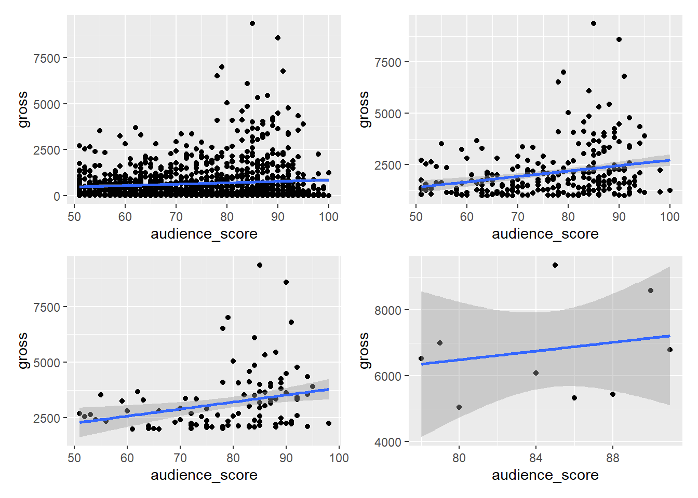
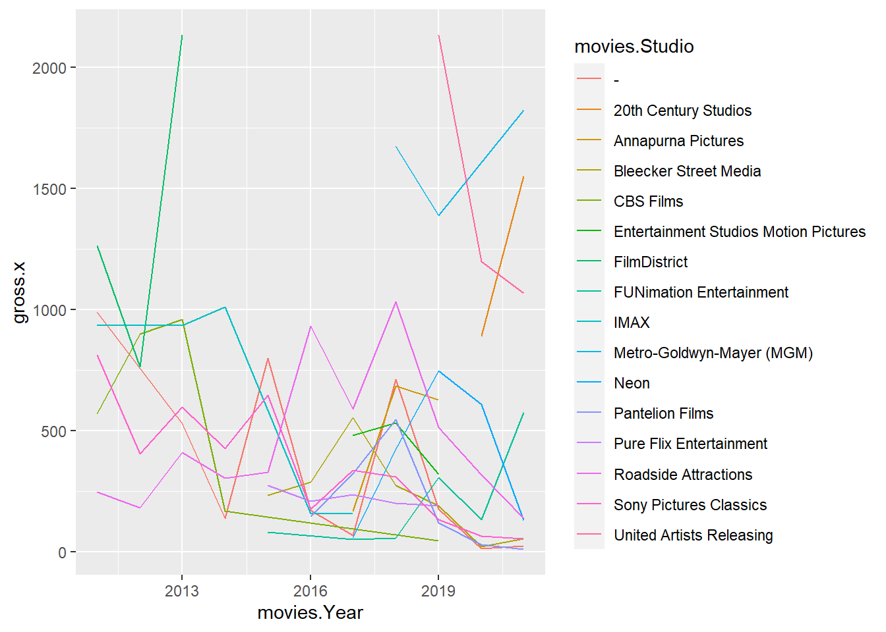
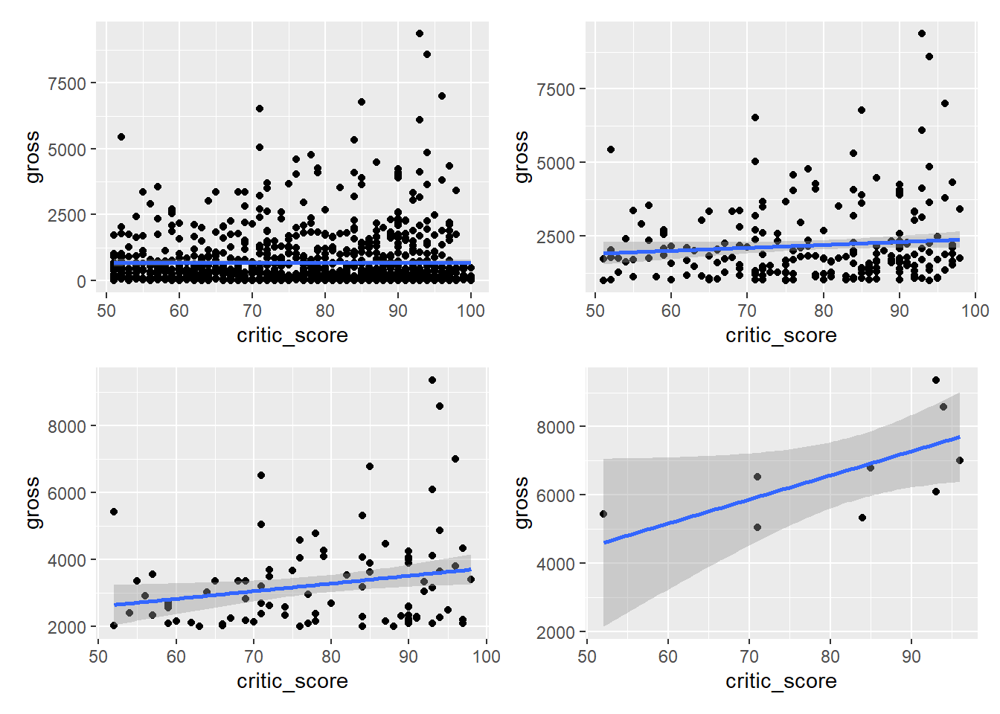
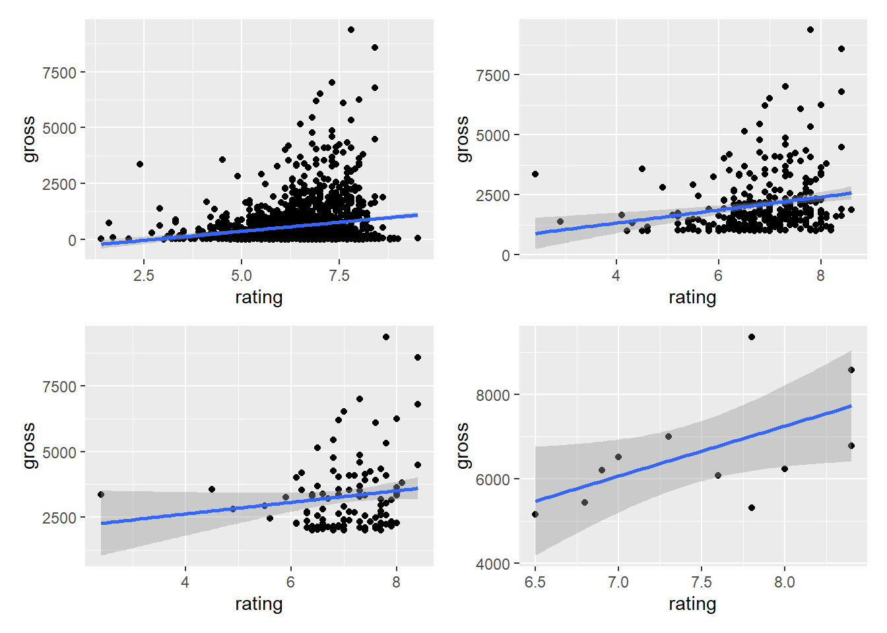
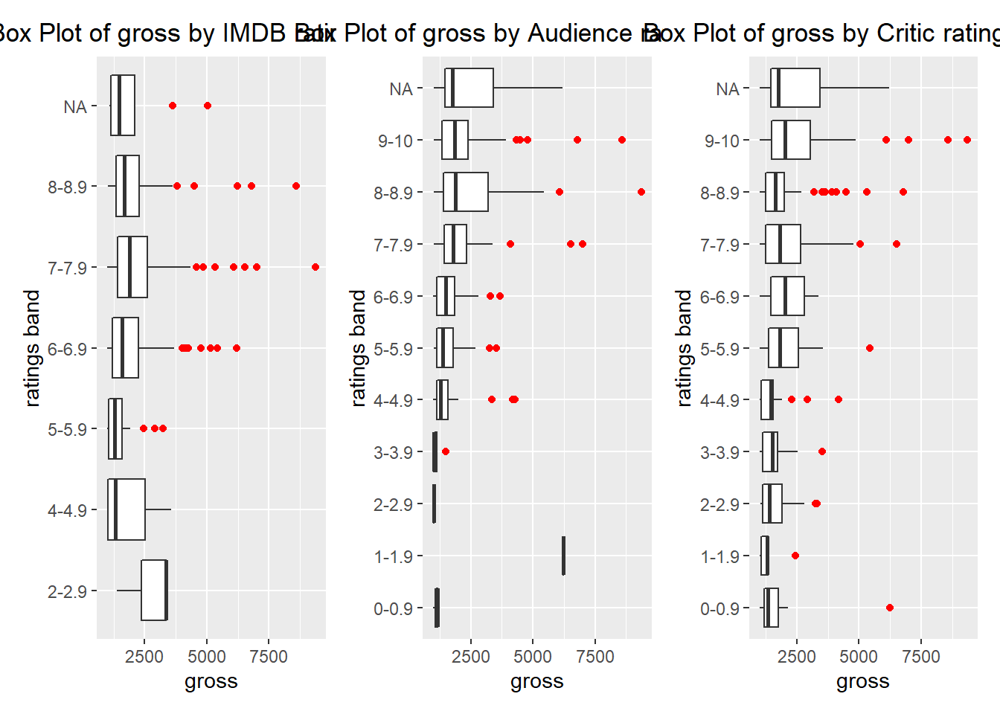
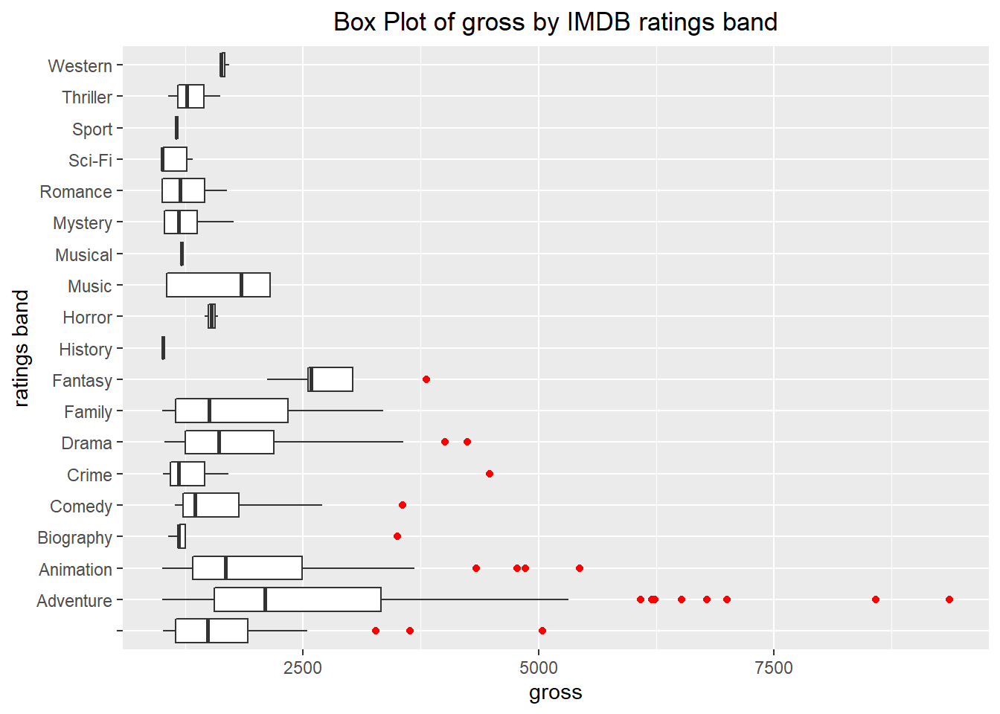

# Results

---
title: "Results"
author: "Charlie Sturr"
date: "12/11/2021"
output: html_document
---


## Aggregating gross and total gross  


 
## COVID IMPACT GOES HERE 

If we zoom our cut in - we can see the month by month drop off. 


## Studios across the board have struggled too 

Filtering only studios who have made over 1B and less than 1B




## Ratings over time 





## Correlation between audience and critic scores - aggregate 


## Correlation between audience and IMDB score - aggregate 


## Correlation between critic and IMDB score - aggregate 


## Correlation between total gross and audience score - aggregate 


## Correlation between total gross and critic score - aggregate 


```r
movies <- read.csv("MOVIES_Final_12.11.2021_vAC.csv")

gross <- as.numeric(movies$Total.Gross)/100000
rating <- as.numeric(movies$average_rating)
audience_score <- as.numeric(movies$Score_Audience)
critic_score <- as.numeric(movies$Score_Rotten)

correlation_df <- data.frame(gross, rating, audience_score, critic_score)

g1<- ggplot(correlation_df %>% filter(gross > 0), aes(x = critic_score, y = gross)) + geom_point() +geom_smooth(method = lm)
g2<- ggplot(correlation_df %>% filter(gross > 1000), aes(x = critic_score, y = gross)) + geom_point()+geom_smooth(method = lm)
g3<- ggplot(correlation_df %>% filter(gross > 2000), aes(x = critic_score, y = gross)) + geom_point()+geom_smooth(method = lm)
g4<- ggplot(correlation_df %>% filter(gross > 5000), aes(x = critic_score, y = gross)) + geom_point()+geom_smooth(method = lm)

g1 + g2 + g3 + g4 +plot_layout(widths = c(1, 1), heights = c(1,1))
```


```r
#test 
```


## Correlation by year - audience vs. critic 


## Correlation by year - imdb vs. audience 


## Correlation by year - imdb vs. critic 


## Correlation between total gross and IMDB score - aggregate 




## Correlation between total gross and critic score - aggregate 


## Correlation between total gross and IMDB score - aggregate 


##Box and Whisker - IMDB rating and gross 


##Box and Whisker - audience rating and gross 


##Box and Whisker - critic rating and gross 





## Aggregating and filtering top earning studios 


## Average IMDB rating by month and year


## Average audience rating by month and year


## Average critic rating by month and year


## Average critic rating by month and year




##GRAVEYARD

##Filtering by "Good and bad movies"


## Correlation between total gross and audience score - aggregate 


## Aggregating and filtering top earning studios 


## CORRELATION by genre


```
##   Rank                                        Title     Gross X..of.Theaters
## 1    1 Harry Potter and the Deathly Hallows: Part 2 381011219           4375
## 2    2               Transformers: Dark of the Moon 352390543           4088
## 3    3    The Twilight Saga: Breaking Dawn - Part 1 274841954           4066
## 4    4                         The Hangover Part II 254464305           3675
## 5    5  Pirates of the Caribbean: On Stranger Tides 241071802           4164
## 6    6                                    Fast Five 209837675           3793
##   Total.Gross Release.Date                              Studio Year
## 1   381011219         7/15                        Warner Bros. 2011
## 2   352390543         6/29                          DreamWorks 2011
## 3   281287133        11/18                Summit Entertainment 2011
## 4   254464305         5/26                        Warner Bros. 2011
## 5   241071802         5/20 Walt Disney Studios Motion Pictures 2011
## 6   209837675         4/29                  Universal Pictures 2011
##   Score_Rotten Score_Audience                     genre    genre1    genre2
## 1           96             89 Adventure,Fantasy,Mystery Adventure   Fantasy
## 2           35             55   Action,Adventure,Sci-Fi    Action Adventure
## 3           25             60   Adventure,Drama,Fantasy Adventure     Drama
## 4           34             52                    Comedy    Comedy          
## 5           33             54  Action,Adventure,Fantasy    Action Adventure
## 6           77             83    Action,Adventure,Crime    Action Adventure
##    genre3 average_rating numvotes startYear MISSING.VALUE Missing.Rotten
## 1 Mystery            8.1   808813      2011             0              0
## 2  Sci-Fi            6.2   395497      2011             0              0
## 3 Fantasy            4.9   232357      2011             0              0
## 4                    6.5   479995      2011             0              0
## 5 Fantasy            6.6   500148      2011             0              0
## 6   Crime            7.3   368386      2011             0              0
##   Missing.IMDB day month final_date
## 1            0  15     7  7/15/2011
## 2            0  29     6  6/29/2011
## 3            0  18    11 11/18/2011
## 4            0  26     5  5/26/2011
## 5            0  20     5  5/20/2011
## 6            0  29     4  4/29/2011
```


