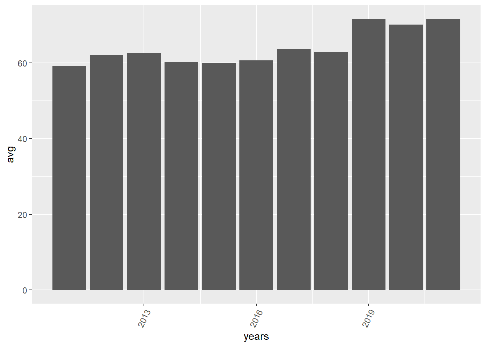

## Correlation between audience and critic scores - aggregate 


```r
movies <- read.csv("MOVIES_Final_12.11.2021_vAC.csv")

gross <- as.numeric(movies$Total.Gross)/100000
rating <- as.numeric(movies$average_rating)
audience_score <- as.numeric(movies$Score_Audience)
critic_score <- as.numeric(movies$Score_Rotten)

correlation_df <- data.frame(gross, rating, audience_score, critic_score)

g1<- ggplot(correlation_df %>% filter(gross > 0), aes(x = audience_score, y = critic_score)) + geom_point()
g2<- ggplot(correlation_df %>% filter(gross > 1000), aes(x = audience_score, y = critic_score)) + geom_point()
g3<- ggplot(correlation_df %>% filter(gross > 2000), aes(x = audience_score, y = critic_score)) + geom_point()
g4<- ggplot(correlation_df %>% filter(gross > 5000), aes(x = audience_score, y = critic_score)) + geom_point()

g1 + g2 + g3 + g4 +plot_layout(widths = c(1, 1), heights = c(1,1))
```


```r
#test 
```


## Correlation between audience and IMDB score - aggregate 


```r
gross <- as.numeric(movies$Total.Gross)/100000
rating <- as.numeric(movies$average_rating)
audience_score <- as.numeric(movies$Score_Audience)
critic_score <- as.numeric(movies$Score_Rotten)

correlation_df <- data.frame(gross, rating, audience_score, critic_score)

g1<- ggplot(correlation_df %>% filter(gross > 0), aes(x = audience_score, y = rating)) + geom_point()
g2<- ggplot(correlation_df %>% filter(gross > 1000), aes(x = audience_score, y = rating)) + geom_point()
g3<- ggplot(correlation_df %>% filter(gross > 2000), aes(x = audience_score, y = rating)) + geom_point()
g4<- ggplot(correlation_df %>% filter(gross > 5000), aes(x = audience_score, y = rating)) + geom_point()

g1 + g2 + g3 + g4 +plot_layout(widths = c(1, 1), heights = c(1,1))
```


## Correlation between critic and IMDB score - aggregate 


```r
gross <- as.numeric(movies$Total.Gross)/100000
rating <- as.numeric(movies$average_rating)
audience_score <- as.numeric(movies$Score_Audience)
critic_score <- as.numeric(movies$Score_Rotten)

correlation_df <- data.frame(gross, rating, audience_score, critic_score)

g1<- ggplot(correlation_df %>% filter(gross > 0), aes(x = critic_score, y = rating)) + geom_point()
g2<- ggplot(correlation_df %>% filter(gross > 1000), aes(x = critic_score, y = rating)) + geom_point()
g3<- ggplot(correlation_df %>% filter(gross > 2000), aes(x = critic_score, y = rating)) + geom_point()
g4<- ggplot(correlation_df %>% filter(gross > 5000), aes(x = critic_score, y = rating)) + geom_point()

g1 + g2 + g3 + g4 +plot_layout(widths = c(1, 1), heights = c(1,1))
```


##Box and Whisker - IMDB rating and gross 


```r
correlation_df$band <- 1
  
  
  
correlation_df <- correlation_df %>%
                  mutate(band = ifelse(rating <1, "0-0.9", 
                                ifelse(rating<2, "1-1.9",
                                      ifelse(rating<3,"2-2.9",
                                             ifelse(rating<4,"3-3.9",
                                                    ifelse(rating<5,"4-4.9",
                                                           ifelse(rating<6,"5-5.9",
                                                                  ifelse(rating<7,"6-6.9",
                                                                         ifelse(rating<8,"7-7.9",
                                                                                ifelse(rating<9,"8-8.9",
                                                                                       ifelse(rating<=10,"9-10")))))))))))


g_imdb <- ggplot(data = correlation_df %>% filter(gross > 1000), mapping = aes(x = gross, y = band)) + 
  geom_boxplot(outlier.color = 'red') + xlab("gross") + ylab("ratings band") + ggtitle("Box Plot of gross by IMDB ratings band")+   theme(plot.title = element_text(hjust = 0.5))

g_imdb
```


##Box and Whisker - audience rating and gross 


```r
correlation_df$audience_band <- 1
  
correlation_df <- correlation_df %>%
                  mutate(audience_band = ifelse(audience_score <10, "0-0.9", 
                                ifelse(audience_score<20, "1-1.9",
                                      ifelse(audience_score<30,"2-2.9",
                                             ifelse(audience_score<40,"3-3.9",
                                                    ifelse(audience_score<50,"4-4.9",
                                                           ifelse(audience_score<60,"5-5.9",
                                                                  ifelse(audience_score<70,"6-6.9",
                                                                         ifelse(audience_score<80,"7-7.9",
                                                                                ifelse(audience_score<90,"8-8.9",
                                                                                       ifelse(audience_score<=100,"9-10","na")))))))))))


g_audience <- ggplot(data = correlation_df %>% filter(gross > 1000), mapping = aes(x = gross, y = audience_band)) + 
  geom_boxplot(outlier.color = 'red') + xlab("gross") + ylab("ratings band") + ggtitle("Box Plot of gross by Audience ratings band")+   theme(plot.title = element_text(hjust = 0.5))

g_audience
```


##Box and Whisker - critic rating and gross 


```r
correlation_df$critic_band <- 1
  
correlation_df <- correlation_df %>%
                  mutate(critic_band = ifelse(critic_score <10, "0-0.9", 
                                ifelse(critic_score<20, "1-1.9",
                                      ifelse(critic_score<30,"2-2.9",
                                             ifelse(critic_score<40,"3-3.9",
                                                    ifelse(critic_score<50,"4-4.9",
                                                           ifelse(critic_score<60,"5-5.9",
                                                                  ifelse(critic_score<70,"6-6.9",
                                                                         ifelse(critic_score<80,"7-7.9",
                                                                                ifelse(critic_score<90,"8-8.9",
                                                                                       ifelse(critic_score<=100,"9-10","na")))))))))))


g_critic <- ggplot(data = correlation_df %>% filter(gross > 1000), mapping = aes(x = gross, y = critic_band)) + 
  geom_boxplot(outlier.color = 'red') + xlab("gross") + ylab("ratings band") + ggtitle("Box Plot of gross by Critic ratings band")+   theme(plot.title = element_text(hjust = 0.5))

g_critic
```


```r
g_imdb + g_audience + g_critic + plot_layout(widths = 3, heights = 3)
```


## Aggregating and filtering top earning studios 


```r
movies <- read.csv("MOVIES_Final_12.11.2021_vAC.csv")

gross <- as.numeric(movies$Total.Gross)/100000


studio_df <- data.frame(gross, movies$Studio)

aggregate_df<- aggregate(gross~movies.Studio, data=studio_df, sum) %>%
  arrange(desc(gross))
```


## Cuts by year - audience vs. critic 


```r
movies <- read.csv("MOVIES_Final_12.11.2021_vAC.csv")


gross <- as.numeric(movies$Total.Gross)/100000
rating <- as.numeric(movies$average_rating)
audience_score <- as.numeric(movies$Score_Audience)
critic_score <- as.numeric(movies$Score_Rotten)
year <- movies$Year

total_year <- data.frame(movies$Title, gross, rating, audience_score, critic_score, year)

year_chart <- ggplot(total_year %>% filter(gross > 500), aes(x = audience_score, y = critic_score)) + geom_point()+ 
  geom_smooth(method=lm) +facet_wrap(~year)

year_chart
```


## Cuts by year - imdb vs. audience 


```r
movies <- read.csv("MOVIES_Final_12.11.2021_vAC.csv")


gross <- as.numeric(movies$Total.Gross)/100000
rating <- as.numeric(movies$average_rating)
audience_score <- as.numeric(movies$Score_Audience)
critic_score <- as.numeric(movies$Score_Rotten)
year <- movies$Year

total_year <- data.frame(movies$Title, gross, rating, audience_score, critic_score, year)

year_chart <- ggplot(total_year %>% filter(gross > 500), aes(x = rating, y = audience_score)) + geom_point()+ 
  geom_smooth(method=lm) +facet_wrap(~year)

year_chart
```


## Cuts by year - imdb vs. critic 


```r
movies <- read.csv("MOVIES_Final_12.11.2021_vAC.csv")


gross <- as.numeric(movies$Total.Gross)/100000
rating <- as.numeric(movies$average_rating)
audience_score <- as.numeric(movies$Score_Audience)
critic_score <- as.numeric(movies$Score_Rotten)
year <- movies$Year

total_year <- data.frame(movies$Title, gross, rating, audience_score, critic_score, year)

year_chart <- ggplot(total_year %>% filter(gross > 500), aes(x = rating, y = critic_score)) + geom_point()+ 
  geom_smooth(method=lm) +facet_wrap(~year)

year_chart
```


## Average IMDB rating by month and year


```r
movies <- read.csv("MOVIES_Final_12.11.2021_vAC.csv")


month <- as.numeric(movies$month)
rating <- as.numeric(movies$average_rating)
audience_score <- as.numeric(movies$Score_Audience)
critic_score <- as.numeric(movies$Score_Rotten)
year <- as.numeric(movies$Year)

averages_chart <- data.frame(movies$Title, month, rating, audience_score, critic_score, year)


months <- data.frame(c(1,2,3,4,5,6,7,8,9,10,11,12))
years = c(2011,2012,2013,2014,2015,2016,2017,2018,2019,2020,2021)

averages_df = data.frame(matrix(nrow = 12, ncol = length(years))) 
  
# assign column names
colnames(averages_df) = years

averages_df$month = c(1,2,3,4,5,6,7,8,9,10,11,12)


averages_chart <- averages_chart %>% filter(averages_chart$month == 5, averages_chart$year == 2012)

my_range <- 1:12
year_range <- 2011:2021

k = 0

for(i in year_range){
  averages_chart <- data.frame(movies$Title, month, rating, audience_score, critic_score, year)
  k = k+1
  for(j in my_range){
    
    averages_chart <- averages_chart %>% filter(!is.na(averages_chart$rating), averages_chart$month == j, averages_chart$year == i)
    averages_df[j,k] = mean(averages_chart$rating)
    averages_chart <- data.frame(movies$Title, month, rating, audience_score, critic_score, year)
  }
    
}


averages_df$month = c(1,2,3,4,5,6,7,8,9,10,11,12)

tidy_averages <- averages_df %>% pivot_longer(!month, names_to = "year", values_to = "averages")

tidy_averages$Date <- with(tidy_averages, sprintf("%s-%02s", year, month))


imdb_time<- ggplot(tidy_averages, aes(Date, averages, fill=year)) + geom_col()+ 
  theme(axis.text.x = element_text(angle = 65, hjust = 1)) 
```

## Average audience rating by month and year


```r
movies <- read.csv("MOVIES_Final_12.11.2021_vAC.csv")


month <- as.numeric(movies$month)
rating <- as.numeric(movies$average_rating)
audience_score <- as.numeric(movies$Score_Audience)
critic_score <- as.numeric(movies$Score_Rotten)
year <- as.numeric(movies$Year)

averages_chart <- data.frame(movies$Title, month, rating, audience_score, critic_score, year)


months <- data.frame(c(1,2,3,4,5,6,7,8,9,10,11,12))
years = c(2011,2012,2013,2014,2015,2016,2017,2018,2019,2020,2021)


averages_df = data.frame(matrix(nrow = 12, ncol = length(years))) 
  
# assign column names
colnames(averages_df) = years

averages_df$month = c(1,2,3,4,5,6,7,8,9,10,11,12)


averages_chart <- averages_chart %>% filter(averages_chart$month == 5, averages_chart$year == 2012)

my_range <- 1:12
year_range <- 2011:2021

k = 0

for(i in year_range){
  averages_chart <- data.frame(movies$Title, month, rating, audience_score, critic_score, year)
  k = k+1
  for(j in my_range){
    
    averages_chart <- averages_chart %>% filter(!is.na(averages_chart$audience_score), averages_chart$month == j, averages_chart$year == i)
    averages_df[j,k] = mean(averages_chart$audience_score)
    averages_chart <- data.frame(movies$Title, month, rating, audience_score, critic_score, year)
  }
    
}


averages_df$month = c(1,2,3,4,5,6,7,8,9,10,11,12)

tidy_averages <- averages_df %>% pivot_longer(!month, names_to = "year", values_to = "averages")

tidy_averages$Date <- with(tidy_averages, sprintf("%s-%02s", year, month))


audience_time<- ggplot(tidy_averages, aes(Date, averages, fill=year)) + geom_col()+ 
  theme(axis.text.x = element_text(angle = 65, hjust = 1)) 
```


## Average critic rating by month and year


```r
movies <- read.csv("MOVIES_Final_12.11.2021_vAC.csv")


month <- as.numeric(movies$month)
rating <- as.numeric(movies$average_rating)
audience_score <- as.numeric(movies$Score_Audience)
critic_score <- as.numeric(movies$Score_Rotten)
year <- as.numeric(movies$Year)

averages_chart <- data.frame(movies$Title, month, rating, audience_score, critic_score, year)


months <- data.frame(c(1,2,3,4,5,6,7,8,9,10,11,12))
years = c(2011,2012,2013,2014,2015,2016,2017,2018,2019,2020,2021)

averages_df = data.frame(matrix(nrow = 12, ncol = length(years))) 
  
# assign column names
colnames(averages_df) = years

averages_df$month = c(1,2,3,4,5,6,7,8,9,10,11,12)


averages_chart <- averages_chart %>% filter(averages_chart$month == 5, averages_chart$year == 2012)

my_range <- 1:12
year_range <- 2011:2021

k = 0

for(i in year_range){
  averages_chart <- data.frame(movies$Title, month, rating, audience_score, critic_score, year)
  k = k+1
  for(j in my_range){
    
    averages_chart <- averages_chart %>% filter(!is.na(averages_chart$critic_score), averages_chart$month == j, averages_chart$year == i)
    averages_df[j,k] = mean(averages_chart$critic_score)
    averages_chart <- data.frame(movies$Title, month, rating, audience_score, critic_score, year)
  }
    
}


averages_df$month = c(1,2,3,4,5,6,7,8,9,10,11,12)

tidy_averages <- averages_df %>% pivot_longer(!month, names_to = "year", values_to = "averages")

tidy_averages$Date <- with(tidy_averages, sprintf("%s-%02s", year, month))


critic_time <- ggplot(tidy_averages, aes(Date, averages, fill=year)) + geom_col()+ 
  theme(axis.text.x = element_text(angle = 65, hjust = 1)) 
```


## Average critic rating by month and year


```r
imdb_time
```


```r
audience_time
```


```r
critic_time
```


## Average ratings by just year


```r
movies <- read.csv("MOVIES_Final_12.11.2021_vAC.csv")


month <- as.numeric(movies$month)
rating <- as.numeric(movies$average_rating)
audience_score <- as.numeric(movies$Score_Audience)
critic_score <- as.numeric(movies$Score_Rotten)
year <- as.numeric(movies$Year)

averages_chart <- data.frame(movies$Title, month, rating, audience_score, critic_score, year)

years = c(2011,2012,2013,2014,2015,2016,2017,2018,2019,2020,2021)

averages_df = data.frame(matrix(nrow = 1, ncol = length(years))) 
  
# assign column names
colnames(averages_df) = years


year_range <- 2011:2021

k = 1

for(i in year_range){
    averages_chart <- averages_chart %>% filter(!is.na(averages_chart$rating), averages_chart$year == i)
    averages_df[1,k] = mean(averages_chart$rating)
    averages_chart <- data.frame(movies$Title, month, rating, audience_score, critic_score, year)
    k = k+1
  }
    

averages_df[nrow(averages_df) + 1,] = years


averages_transposed = as.data.frame(t(averages_df))


names(averages_transposed)[2] <- "years"
names(averages_transposed)[1] <- "avg"


#tidy_averages <- averages_df %>% pivot_longer(!month, names_to = "year", values_to = "averages")

#tidy_averages$Date <- with(tidy_averages, sprintf("%s-%02s", year, month))


ggplot(averages_transposed, aes(years, avg)) + geom_col()+ 
  theme(axis.text.x = element_text(angle = 65, hjust = 1)) 
```


## Average ratings by just year


```r
movies <- read.csv("MOVIES_Final_12.11.2021_vAC.csv")


month <- as.numeric(movies$month)
rating <- as.numeric(movies$average_rating)
audience_score <- as.numeric(movies$Score_Audience)
critic_score <- as.numeric(movies$Score_Rotten)
year <- as.numeric(movies$Year)

averages_chart <- data.frame(movies$Title, month, rating, audience_score, critic_score, year)

years = c(2011,2012,2013,2014,2015,2016,2017,2018,2019,2020,2021)


averages_df = data.frame(matrix(nrow = 1, ncol = length(years))) 
  
# assign column names
colnames(averages_df) = years


year_range <- 2011:2021

k = 1

for(i in year_range){
    averages_chart <- averages_chart %>% filter(!is.na(averages_chart$audience_score), averages_chart$year == i)
    averages_df[1,k] = mean(averages_chart$audience_score)
    averages_chart <- data.frame(movies$Title, month, rating, audience_score, critic_score, year)
    k = k+1
  }
    

averages_df[nrow(averages_df) + 1,] = years


averages_transposed = as.data.frame(t(averages_df))


names(averages_transposed)[2] <- "years"
names(averages_transposed)[1] <- "avg"


#tidy_averages <- averages_df %>% pivot_longer(!month, names_to = "year", values_to = "averages")

#tidy_averages$Date <- with(tidy_averages, sprintf("%s-%02s", year, month))


ggplot(averages_transposed, aes(years, avg)) + geom_col()+ 
  theme(axis.text.x = element_text(angle = 65, hjust = 1)) 
```




## Average ratings by just year


```r
movies <- read.csv("MOVIES_Final_12.11.2021_vAC.csv")


month <- as.numeric(movies$month)
rating <- as.numeric(movies$average_rating)
audience_score <- as.numeric(movies$Score_Audience)
critic_score <- as.numeric(movies$Score_Rotten)
year <- as.numeric(movies$Year)

averages_chart <- data.frame(movies$Title, month, rating, audience_score, critic_score, year)

years = c(2011,2012,2013,2014,2015,2016,2017,2018,2019,2020,2021)

averages_df = data.frame(matrix(nrow = 1, ncol = length(years))) 
  
# assign column names
colnames(averages_df) = years


year_range <- 2011:2021

k = 1

for(i in year_range){
    averages_chart <- averages_chart %>% filter(!is.na(averages_chart$critic_score), averages_chart$year == i)
    averages_df[1,k] = mean(averages_chart$critic_score)
    averages_chart <- data.frame(movies$Title, month, rating, audience_score, critic_score, year)
    k = k+1
  }
    

averages_df[nrow(averages_df) + 1,] = years


averages_transposed = as.data.frame(t(averages_df))


names(averages_transposed)[2] <- "years"
names(averages_transposed)[1] <- "avg"


#tidy_averages <- averages_df %>% pivot_longer(!month, names_to = "year", values_to = "averages")

#tidy_averages$Date <- with(tidy_averages, sprintf("%s-%02s", year, month))


ggplot(averages_transposed, aes(years, avg)) + geom_col()+ 
  theme(axis.text.x = element_text(angle = 65, hjust = 1)) 
```


## by genre


```r
movies <- read.csv("MOVIES_Final_12.11.2021_vAC.csv")

head(movies)
```

```
##   Rank                                        Title     Gross X..of.Theaters
## 1    1 Harry Potter and the Deathly Hallows: Part 2 381011219           4375
## 2    2               Transformers: Dark of the Moon 352390543           4088
## 3    3    The Twilight Saga: Breaking Dawn - Part 1 274841954           4066
## 4    4                         The Hangover Part II 254464305           3675
## 5    5  Pirates of the Caribbean: On Stranger Tides 241071802           4164
## 6    6                                    Fast Five 209837675           3793
##   Total.Gross Release.Date                              Studio Year
## 1   381011219         7/15                        Warner Bros. 2011
## 2   352390543         6/29                          DreamWorks 2011
## 3   281287133        11/18                Summit Entertainment 2011
## 4   254464305         5/26                        Warner Bros. 2011
## 5   241071802         5/20 Walt Disney Studios Motion Pictures 2011
## 6   209837675         4/29                  Universal Pictures 2011
##   Score_Rotten Score_Audience                     genre    genre1    genre2
## 1           96             89 Adventure,Fantasy,Mystery Adventure   Fantasy
## 2           35             55   Action,Adventure,Sci-Fi    Action Adventure
## 3           25             60   Adventure,Drama,Fantasy Adventure     Drama
## 4           34             52                    Comedy    Comedy          
## 5           33             54  Action,Adventure,Fantasy    Action Adventure
## 6           77             83    Action,Adventure,Crime    Action Adventure
##    genre3 average_rating numvotes startYear MISSING.VALUE Missing.Rotten
## 1 Mystery            8.1   808813      2011             0              0
## 2  Sci-Fi            6.2   395497      2011             0              0
## 3 Fantasy            4.9   232357      2011             0              0
## 4                    6.5   479995      2011             0              0
## 5 Fantasy            6.6   500148      2011             0              0
## 6   Crime            7.3   368386      2011             0              0
##   Missing.IMDB day month final_date
## 1            0  15     7  7/15/2011
## 2            0  29     6  6/29/2011
## 3            0  18    11 11/18/2011
## 4            0  26     5  5/26/2011
## 5            0  20     5  5/20/2011
## 6            0  29     4  4/29/2011
```

```r
gross <- as.numeric(movies$Total.Gross)/100000
rating <- as.numeric(movies$average_rating)
audience_score <- as.numeric(movies$Score_Audience)
critic_score <- as.numeric(movies$Score_Rotten)

genre_df <- data.frame(movies$Title, gross, audience_score, critic_score, rating, movies$genre1, movies$genre2, movies$genre3, movies$genre)
colnames(genre_df) = c("title", "gross", "score_audience", "score_rotten", "average_rating", "genre1", "genre2", "genre3", "genre")

aggregate_genre1<- aggregate(gross~genre1, data=genre_df, sum) %>%
  arrange(desc(gross))

aggregate_genre2<- aggregate(gross~genre2, data=genre_df %>% filter(genre_df$genre2 != ""), sum) %>%
  arrange(desc(gross))

aggregate_genre3<- aggregate(gross~genre3, data=genre_df %>% filter(genre_df$genre3 != ""), sum) %>%
  arrange(desc(gross))

aggregate_genre <- aggregate(gross~genre, data=genre_df %>% filter(genre_df$genre != ""), sum) %>% 
  arrange(desc(gross))


genre1_unique <- unique(genre_df$genre1)
genre2_unique <- unique(genre_df$genre2)
genre3_unique <- unique(genre_df$genre3)

genre_unique <- unique(genre_df$genre)


g_genre1 <- ggplot(data = genre_df %>% filter(gross > 1000), mapping = aes(x = gross, y = genre1)) + 
  geom_boxplot(outlier.color = 'red') + xlab("gross") + ylab("ratings band") + ggtitle("Box Plot of gross by IMDB ratings band")+   theme(plot.title = element_text(hjust = 0.5))


g_genre2 <- ggplot(data = genre_df %>% filter(gross > 1000), mapping = aes(x = gross, y = genre2)) + 
  geom_boxplot(outlier.color = 'red') + xlab("gross") + ylab("ratings band") + ggtitle("Box Plot of gross by IMDB ratings band")+   theme(plot.title = element_text(hjust = 0.5))


g_genre3 <- ggplot(data = genre_df %>% filter(gross > 1000), mapping = aes(x = gross, y = genre3)) + 
  geom_boxplot(outlier.color = 'red') + xlab("gross") + ylab("ratings band") + ggtitle("Box Plot of gross by IMDB ratings band")+   theme(plot.title = element_text(hjust = 0.5))


g_genre1
```


```r
g_genre2
```


```r
g_genre3
```


```r
genre_filtered <- genre_df %>% filter(gross>50, genre1 == c("Action", "Adventure", "Comedy", "Biography", "Horror", "Documentary", "Animation"), score_audience != "MISSING VALUE")


genre_correlation <- ggplot(genre_filtered, aes(x = score_audience, y = gross)) + geom_point()+ 
  geom_smooth(method=lm) + facet_wrap(~genre1)

genre_correlation
```


