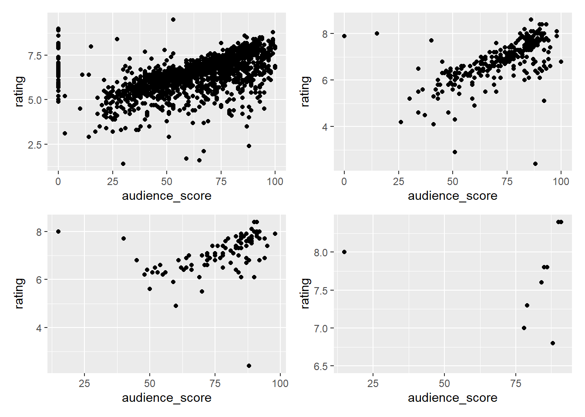
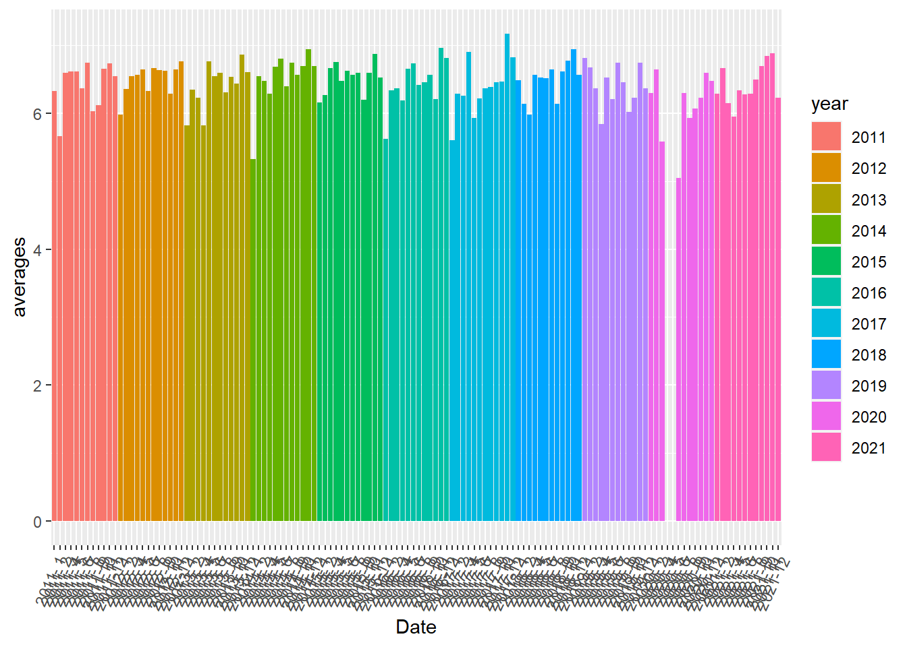
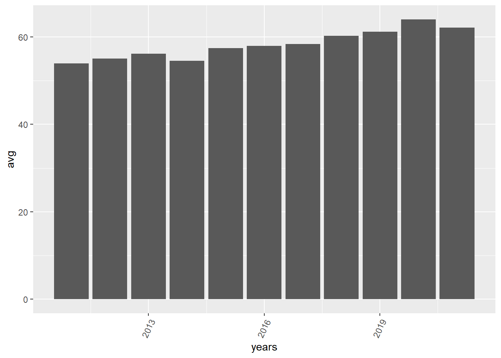
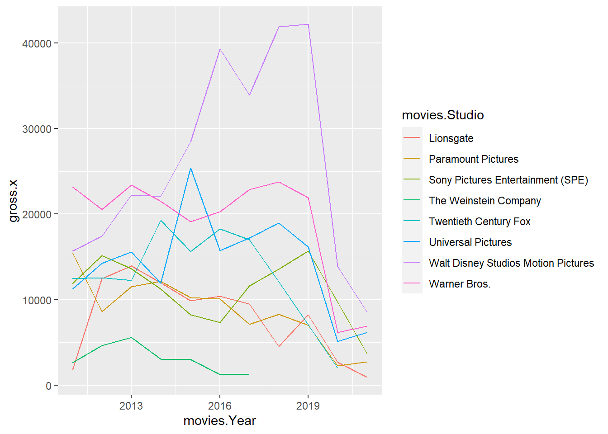
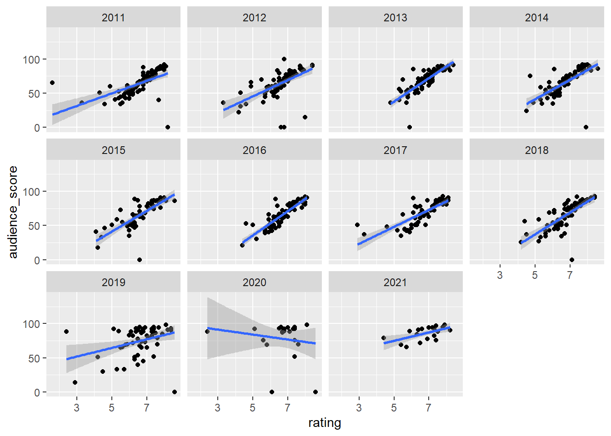
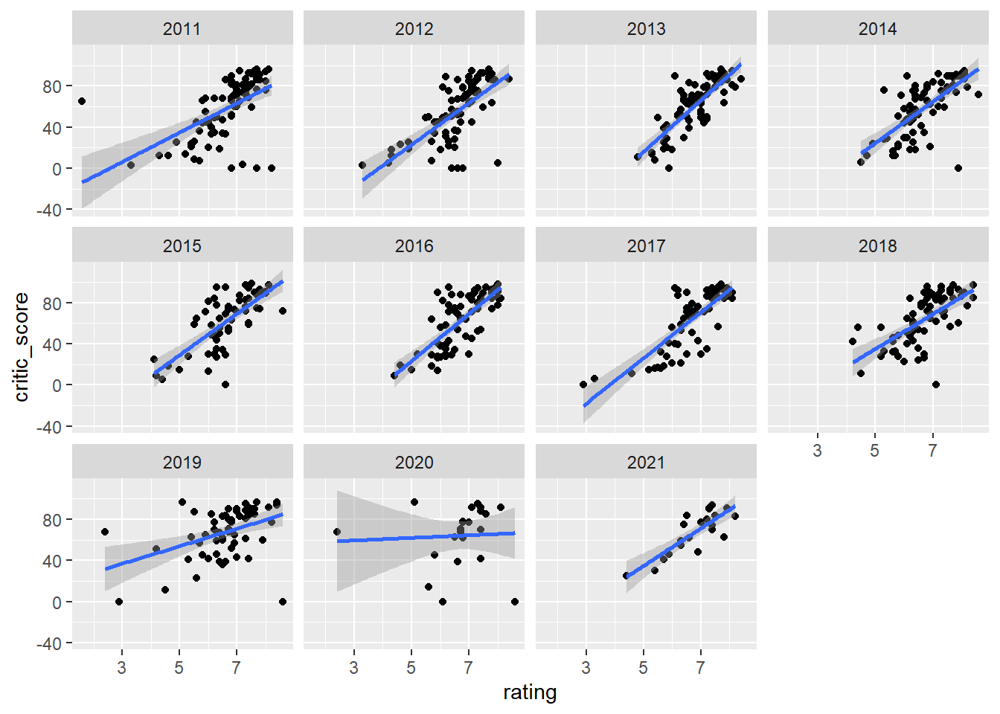

--- 
title: "Movie Rating Analysis Test"
author: "Sharmi Mathur, Charlie Sturr, Ayush Baral"
date: "2021-12-12"
site: bookdown::bookdown_site
---


# Introduction

In the world of rotten tomatoes, metacritic, IMDB, and many others, movies are often picked apart
by critics before audiences have a chance to even see the film. Although audiences often turn to these
resources as a way to gauge their interest in seeing the actual film, many executives have bemoaned
the prevalence of online reviews. A 2017 New York Times article, which explores Hollywood’s reaction
to a flat 2017 summer season, quotes industry insiders as saying: ”I think it’s [Rotten Tomatoes] the
destruction of our business” (Brett Ratner, director, producer and film financier).

For our final project, we decided to take a deeper look at the entertainment industry. Therefore, our
questions and objectives for this project will be centered around exploring the relationship between
studio budgets, audience / critic perception, and box office performance, to see if Hollywood executives
have taken any basic statistics courses and are justified in their complaints about the negative impact
of Rotten Tomatoes (and others).

### Our questions are as follows:
1. How have Rotten Tomatoes / Metacritic / IMDB Ratings trended over time? Are audiences
getting more or less pessimistic?
2. How have box office returns trended over time? Are movies making more money or less? How
are box office returns distributed? Is there a more equitable split across all movies released in a
given quarter or have earnings consolidated?
3. What is the correlation between audience scores and box office success?
4. What is the correlation between studio budget and box office success?
5. Do high-budget / low rating movies make more money? Or do low-budget, high ratings movies
make more money?
6. How does movie genre impact these previous questions? Can we split across horror / action /
romance / etc.?
7. What would be the relationship between the movies, that were released on the same date?
8. How well did the movies perform financially, when they were released on the same weekend?

<!--chapter:end:index.Rmd-->


# Data sources

In order to aggregate a comprehensive list of movie titles, box office gross, and ratings, we turned to the following data sources and followed the following processes. 

The first observation we made is that the IMDB data set with aggregate movies, genres, and ratings was quite large. For movies alone, there were well over millions of titles from around the world. Therefore, we needed to make some strategic decisions about which movies to include, and what logic to include. Because of the sheer volume of titles, we aggregated the following: 

* We constrained our movies to be within movies released from 2011 to 2021 
* We constrained the movies included to be the top 200 total grossing movies from each year
  + Total gross includes both box office and streaming services 

Once we constrained our list, the first task was to get a working list of the movies we wanted to include. We first turned to box office mojo, https://www.boxofficemojo.com/, which is a product offered by IMDB. In box office mojo, IMDB aggregates the top 200 movies from each year by title, gross, total gross, and number of theaters the film was released in. Using this data source, we aggregated all movies from each year to create our first data frame and get our initial movie list we planned to scrape. 

## Rotten Tomatoes
Rotten Tomatoes is one of the most cited and well known movie ratings websites in the world. Rotten Tomatoes aggregates both an "audience score" and a "critics score". This distinction is important, as one of our focuses of our analysis is looking at how reviews impact box office scores, and so by having both of these perspectives we can see if one or the other drives box office performance more. 

In order to aggregate our Rotten Tomatoes data, we used a simple Rotten Tomatoes scraper package in python. The documentation can be found here: https://github.com/pdrm83/rotten_tomatoes_scraper 

To implement this scraper, we passed in our initial list of 2,200 movie titles that we had originally sorted by box office gross in our initial data collection. By iterating through each title in our list, we were able to successfully scrape both audience and critic ratings from Rotten Tomatoes, with only minor data loss (more on that in the missing values section).


## IMDB
As previously mentioned, the IMDB data set is quite large. Because IMDB traces movies, shorts, and TV shows back to the early days of film (the early 1900s), the data set was quite unweildy and took quite a bit of masnaging to wrangle. We will cover exactly how we cleaned this data in our cleaning section. 

The two files we pulled from the IMDB data were the "title.ratings.tsv.gz" and "title.basic.tsv.gz". The documentation can be found here: https://www.imdb.com/interfaces/ 

For the ratings file, there were 3 elements: 

* tconst (the unique title identifier; a string)
* averageRating (from 0-10)
* numVotes (the number of votes included)

For the titles file, there were 9 elements: 

* tconst (the unique title identifier; a string)
* titleType (the type of film it is - could be TV Show, Movie, Short, etc.)
* primaryTitle (the title used in promotional materials. This was the title we used in our filtering)
* originalTitle (the title originally used. Typically the two titles are the same, unless one is in a different language)
* isAdult (boolean operator for adult movies. We did not include any adult movies in our analysis)
* startYear (release year of the title)
* endYear (only used for TV series; if the series ended)
* runTimeMinutes (run time of the title)
* genres (the genre of the film. Can be 1 - 3 values in a string)

## Final Data Table

After aggregating the three data sources, we had the following data inputs: 


```
##  [1] "Rank - ranking of box office gross within the release year"
##  [2] "Movie Title"                                               
##  [3] "Gross"                                                     
##  [4] "Number of Theaters"                                        
##  [5] "Total Gross - includes streaming / DVD / etc."             
##  [6] "Release Date (D/M)"                                        
##  [7] "Primary Studio"                                            
##  [8] "Year Released"                                             
##  [9] "Critic score scraped from RT"                              
## [10] "Audience score scraped from RT"                            
## [11] "Genre - concatenated - max 3 elements"                     
## [12] "1st genre element"                                         
## [13] "2nd genre element"                                         
## [14] "3rd genre element"                                         
## [15] "Average IMDB rating"                                       
## [16] "Number of IMDB votes"                                      
## [17] "Year pulled from IMDB"
```

=======
* Scraped data from rotten tomatoes
* Downloaded from imdb
* Chosen because these are the biggest hubs for movie information
* Refer to sample column names above
* Started from 2300
  * Talk about how we picked the top 200 movies
  * Talk about why we picked the top 200 movies
* Issues: duplicate names, same movie multiple countries

<!--chapter:end:02-data.Rmd-->


# Data transformation

The data transofrmation process was relatively straightforward. For each source, we will go through how and in what platforms we aggregated the values.

## Box Office Mojo
The box office mojo data set is presented in a simple table that is easily scraped from the website. For each year we were evaluating, we filted by top 200 movies, and imported the data into a CSV by title. From there, we had an aggregate list of 2,200 movies from 2011-2021. 


## Rotten Tomatoes
Once we ran the scraper, we output the rotten tomatoes data from jupyter notebook into a CSV. The data was organized by movie title, and by critic / audience rating. 

## IMDB
This was one of the most cumbersome cleaning processes, because the data set was so large. In order to make it more managable, we did all of our maniuplation in python, and filtered on the following: 

* Release Year - we had to convert to a numeric string, and then filtered if release year was greater than 2010
* Title Type - we filtered only movies 

From there, we imported a new .dat file that was the aggregate list of 2,200 movies we had originally scraped from Box Office Mojo, and iterated through the remaining data values to pull the required IMDB data. We output the new IMDB data into a CSV file as well. 

## Aggregation
After our scraping from the 3 sources, we had 3 unique CSV files. We merged these files by title, to create our aggregate list of movies and the corresponding data points. 
=======
* Downloaded data from imdb
  * tsv
* Scraped rotten tomatoes
  * Excel spreadsheet to csv
* Brought together with python
  * Merge on *whatever column names*

<!--chapter:end:03-cleaning.Rmd-->

---
title: "Missing Value"
output: html_document
---


Here, 
The three chart shows us in which row do we have missing values. Like from the first bar chart, we can see that we are missing more than 750 rows of data in the Genre_3 or G_3 column. Using this data gives us a bit of an idea on how to proceed with further analysis.


Here, we can see where in our dataset do we have na values or the missing values, which columns have more missing data.This tile visualization provides us with a concrete idea of the placement of the missing values. Example: We can see that there are a lot of movies with Genre_3 which are missing some values. Here we only took the data from 100-200. Just to show the example, and the visualization better.


## Looking For Missing Data In The Ratings: IMDB, Score_Audience and Score_Rotten
Here, we created three extra columns to check whether we had any missing ratings or scores abd populated them with 1 and 0. 1 for True they are missing and 0 for false they are not. We can see that in our dataset, we had 150 missing IMDB ratings for our movies, and about 110 values for our audience score, and the total missing values for score_ratings were about 260. Here, MISSING.VALUE is score ratings.


<!--chapter:end:04-missing.Rmd-->


# Results

---
title: "Results"
author: "Charlie Sturr"
date: "12/11/2021"
output: html_document
---


## Correlation between total gross and audience score - aggregate 


```r
movies <- read.csv("MOVIES_Final_12.11.2021_vAC.csv")

gross <- as.numeric(movies$Total.Gross)/100000
rating <- as.numeric(movies$average_rating)
audience_score <- as.numeric(movies$Score_Audience)
critic_score <- as.numeric(movies$Score_Rotten)

correlation_df <- data.frame(gross, rating, audience_score, critic_score)

g1<- ggplot(correlation_df %>% filter(gross > 0), aes(x = audience_score, y = gross)) + geom_point() +geom_smooth(method = lm)
g2<- ggplot(correlation_df %>% filter(gross > 1000), aes(x = audience_score, y = gross)) + geom_point()+geom_smooth(method = lm)
g3<- ggplot(correlation_df %>% filter(gross > 2000), aes(x = audience_score, y = gross)) + geom_point()+geom_smooth(method = lm)
g4<- ggplot(correlation_df %>% filter(gross > 5000), aes(x = audience_score, y = gross)) + geom_point()+geom_smooth(method = lm)

g1 + g2 + g3 + g4 +plot_layout(widths = c(1, 1), heights = c(1,1))
```


```r
#test 
```


## Correlation between total gross and critic score - aggregate 


```r
movies <- read.csv("MOVIES_Final_12.11.2021_vAC.csv")

gross <- as.numeric(movies$Total.Gross)/100000
rating <- as.numeric(movies$average_rating)
audience_score <- as.numeric(movies$Score_Audience)
critic_score <- as.numeric(movies$Score_Rotten)

correlation_df <- data.frame(gross, rating, audience_score, critic_score)

g1<- ggplot(correlation_df %>% filter(gross > 0), aes(x = critic_score, y = gross)) + geom_point() +geom_smooth(method = lm)
g2<- ggplot(correlation_df %>% filter(gross > 1000), aes(x = critic_score, y = gross)) + geom_point()+geom_smooth(method = lm)
g3<- ggplot(correlation_df %>% filter(gross > 2000), aes(x = critic_score, y = gross)) + geom_point()+geom_smooth(method = lm)
g4<- ggplot(correlation_df %>% filter(gross > 5000), aes(x = critic_score, y = gross)) + geom_point()+geom_smooth(method = lm)

g1 + g2 + g3 + g4 +plot_layout(widths = c(1, 1), heights = c(1,1))
```


```r
#test 
```


## Correlation between total gross and IMDB score - aggregate 


```r
movies <- read.csv("MOVIES_Final_12.11.2021_vAC.csv")

gross <- as.numeric(movies$Total.Gross)/100000
rating <- as.numeric(movies$average_rating)
audience_score <- as.numeric(movies$Score_Audience)
critic_score <- as.numeric(movies$Score_Rotten)

correlation_df <- data.frame(gross, rating, audience_score, critic_score)

g1<- ggplot(correlation_df %>% filter(gross > 0), aes(x = rating, y = gross)) + geom_point() +geom_smooth(method = lm)
g2<- ggplot(correlation_df %>% filter(gross > 1000), aes(x = rating, y = gross)) + geom_point()+geom_smooth(method = lm)
g3<- ggplot(correlation_df %>% filter(gross > 2000), aes(x = rating, y = gross)) + geom_point()+geom_smooth(method = lm)
g4<- ggplot(correlation_df %>% filter(gross > 5000), aes(x = rating, y = gross)) + geom_point()+geom_smooth(method = lm)

g1 + g2 + g3 + g4 +plot_layout(widths = c(1, 1), heights = c(1,1))
```


```r
#test 
```


#Filtering by "Good and bad movies"


## Correlation between total gross and audience score - aggregate 


```r
movies <- read.csv("MOVIES_Final_12.11.2021_vAC.csv")

gross <- as.numeric(movies$Total.Gross)/100000
rating <- as.numeric(movies$average_rating)
audience_score <- as.numeric(movies$Score_Audience)
critic_score <- as.numeric(movies$Score_Rotten)

correlation_df <- data.frame(gross, rating, audience_score, critic_score)

g1<- ggplot(correlation_df %>% filter(gross > 0, audience_score>50), aes(x = audience_score, y = gross)) + geom_point() +geom_smooth(method = lm)
g2<- ggplot(correlation_df %>% filter(gross > 1000, audience_score>50), aes(x = audience_score, y = gross)) + geom_point()+geom_smooth(method = lm)
g3<- ggplot(correlation_df %>% filter(gross > 2000, audience_score>50), aes(x = audience_score, y = gross)) + geom_point()+geom_smooth(method = lm)
g4<- ggplot(correlation_df %>% filter(gross > 5000, audience_score>50), aes(x = audience_score, y = gross)) + geom_point()+geom_smooth(method = lm)

g1 + g2 + g3 + g4 +plot_layout(widths = c(1, 1), heights = c(1,1))
```


```r
#test 
```


## Correlation between total gross and critic score - aggregate 


```r
movies <- read.csv("MOVIES_Final_12.11.2021_vAC.csv")

gross <- as.numeric(movies$Total.Gross)/100000
rating <- as.numeric(movies$average_rating)
audience_score <- as.numeric(movies$Score_Audience)
critic_score <- as.numeric(movies$Score_Rotten)

correlation_df <- data.frame(gross, rating, audience_score, critic_score)

g1<- ggplot(correlation_df %>% filter(gross > 0, critic_score>50), aes(x = critic_score, y = gross)) + geom_point() +geom_smooth(method = lm)
g2<- ggplot(correlation_df %>% filter(gross > 1000, critic_score>50), aes(x = critic_score, y = gross)) + geom_point()+geom_smooth(method = lm)
g3<- ggplot(correlation_df %>% filter(gross > 2000,critic_score>50), aes(x = critic_score, y = gross)) + geom_point()+geom_smooth(method = lm)
g4<- ggplot(correlation_df %>% filter(gross > 5000,critic_score>50), aes(x = critic_score, y = gross)) + geom_point()+geom_smooth(method = lm)

g1 + g2 + g3 + g4 +plot_layout(widths = c(1, 1), heights = c(1,1))
```


```r
#test 
```


## Correlation between total gross and IMDB score - aggregate 


```r
movies <- read.csv("MOVIES_Final_12.11.2021_vAC.csv")

gross <- as.numeric(movies$Total.Gross)/100000
rating <- as.numeric(movies$average_rating)
audience_score <- as.numeric(movies$Score_Audience)
critic_score <- as.numeric(movies$Score_Rotten)

correlation_df <- data.frame(gross, rating, audience_score, critic_score)

g1<- ggplot(correlation_df %>% filter(gross > 0, rating>5), aes(x = rating, y = gross)) + geom_point() +geom_smooth(method = lm)
g2<- ggplot(correlation_df %>% filter(gross > 1000, rating>5), aes(x = rating, y = gross)) + geom_point()+geom_smooth(method = lm)
g3<- ggplot(correlation_df %>% filter(gross > 2000, rating>5), aes(x = rating, y = gross)) + geom_point()+geom_smooth(method = lm)
g4<- ggplot(correlation_df %>% filter(gross > 5000, rating>5), aes(x = rating, y = gross)) + geom_point()+geom_smooth(method = lm)

g1 + g2 + g3 + g4 +plot_layout(widths = c(1, 1), heights = c(1,1))
```


```r
#test 
```


## Correlation between audience and critic scores - aggregate 


```r
movies <- read.csv("MOVIES_Final_12.11.2021_vAC.csv")

gross <- as.numeric(movies$Total.Gross)/100000
rating <- as.numeric(movies$average_rating)
audience_score <- as.numeric(movies$Score_Audience)
critic_score <- as.numeric(movies$Score_Rotten)

correlation_df <- data.frame(gross, rating, audience_score, critic_score)

g1<- ggplot(correlation_df %>% filter(gross > 0), aes(x = audience_score, y = critic_score)) + geom_point()
g2<- ggplot(correlation_df %>% filter(gross > 1000), aes(x = audience_score, y = critic_score)) + geom_point()
g3<- ggplot(correlation_df %>% filter(gross > 2000), aes(x = audience_score, y = critic_score)) + geom_point()
g4<- ggplot(correlation_df %>% filter(gross > 5000), aes(x = audience_score, y = critic_score)) + geom_point()

g1 + g2 + g3 + g4 +plot_layout(widths = c(1, 1), heights = c(1,1))
```


```r
#test 
```


## Correlation between audience and IMDB score - aggregate 


```r
gross <- as.numeric(movies$Total.Gross)/100000
rating <- as.numeric(movies$average_rating)
audience_score <- as.numeric(movies$Score_Audience)
critic_score <- as.numeric(movies$Score_Rotten)

correlation_df <- data.frame(gross, rating, audience_score, critic_score)

g1<- ggplot(correlation_df %>% filter(gross > 0), aes(x = audience_score, y = rating)) + geom_point()
g2<- ggplot(correlation_df %>% filter(gross > 1000), aes(x = audience_score, y = rating)) + geom_point()
g3<- ggplot(correlation_df %>% filter(gross > 2000), aes(x = audience_score, y = rating)) + geom_point()
g4<- ggplot(correlation_df %>% filter(gross > 5000), aes(x = audience_score, y = rating)) + geom_point()

g1 + g2 + g3 + g4 +plot_layout(widths = c(1, 1), heights = c(1,1))
```




## Correlation between critic and IMDB score - aggregate 


```r
gross <- as.numeric(movies$Total.Gross)/100000
rating <- as.numeric(movies$average_rating)
audience_score <- as.numeric(movies$Score_Audience)
critic_score <- as.numeric(movies$Score_Rotten)

correlation_df <- data.frame(gross, rating, audience_score, critic_score)

g1<- ggplot(correlation_df %>% filter(gross > 0), aes(x = critic_score, y = rating)) + geom_point()
g2<- ggplot(correlation_df %>% filter(gross > 1000), aes(x = critic_score, y = rating)) + geom_point()
g3<- ggplot(correlation_df %>% filter(gross > 2000), aes(x = critic_score, y = rating)) + geom_point()
g4<- ggplot(correlation_df %>% filter(gross > 5000), aes(x = critic_score, y = rating)) + geom_point()

g1 + g2 + g3 + g4 +plot_layout(widths = c(1, 1), heights = c(1,1))
```


##Box and Whisker - IMDB rating and gross 


```r
correlation_df$band <- 1
  
  
  
correlation_df <- correlation_df %>%
                  mutate(band = ifelse(rating <1, "0-0.9", 
                                ifelse(rating<2, "1-1.9",
                                      ifelse(rating<3,"2-2.9",
                                             ifelse(rating<4,"3-3.9",
                                                    ifelse(rating<5,"4-4.9",
                                                           ifelse(rating<6,"5-5.9",
                                                                  ifelse(rating<7,"6-6.9",
                                                                         ifelse(rating<8,"7-7.9",
                                                                                ifelse(rating<9,"8-8.9",
                                                                                       ifelse(rating<=10,"9-10")))))))))))


g_imdb <- ggplot(data = correlation_df %>% filter(gross > 1000), mapping = aes(x = gross, y = band)) + 
  geom_boxplot(outlier.color = 'red') + xlab("gross") + ylab("ratings band") + ggtitle("Box Plot of gross by IMDB ratings band")+   theme(plot.title = element_text(hjust = 0.5))

g_imdb
```


##Box and Whisker - audience rating and gross 


```r
correlation_df$audience_band <- 1
  
correlation_df <- correlation_df %>%
                  mutate(audience_band = ifelse(audience_score <10, "0-0.9", 
                                ifelse(audience_score<20, "1-1.9",
                                      ifelse(audience_score<30,"2-2.9",
                                             ifelse(audience_score<40,"3-3.9",
                                                    ifelse(audience_score<50,"4-4.9",
                                                           ifelse(audience_score<60,"5-5.9",
                                                                  ifelse(audience_score<70,"6-6.9",
                                                                         ifelse(audience_score<80,"7-7.9",
                                                                                ifelse(audience_score<90,"8-8.9",
                                                                                       ifelse(audience_score<=100,"9-10","na")))))))))))


g_audience <- ggplot(data = correlation_df %>% filter(gross > 1000), mapping = aes(x = gross, y = audience_band)) + 
  geom_boxplot(outlier.color = 'red') + xlab("gross") + ylab("ratings band") + ggtitle("Box Plot of gross by Audience ratings band")+   theme(plot.title = element_text(hjust = 0.5))

g_audience
```


##Box and Whisker - critic rating and gross 


```r
correlation_df$critic_band <- 1
  
correlation_df <- correlation_df %>%
                  mutate(critic_band = ifelse(critic_score <10, "0-0.9", 
                                ifelse(critic_score<20, "1-1.9",
                                      ifelse(critic_score<30,"2-2.9",
                                             ifelse(critic_score<40,"3-3.9",
                                                    ifelse(critic_score<50,"4-4.9",
                                                           ifelse(critic_score<60,"5-5.9",
                                                                  ifelse(critic_score<70,"6-6.9",
                                                                         ifelse(critic_score<80,"7-7.9",
                                                                                ifelse(critic_score<90,"8-8.9",
                                                                                       ifelse(critic_score<=100,"9-10","na")))))))))))


g_critic <- ggplot(data = correlation_df %>% filter(gross > 1000), mapping = aes(x = gross, y = critic_band)) + 
  geom_boxplot(outlier.color = 'red') + xlab("gross") + ylab("ratings band") + ggtitle("Box Plot of gross by Critic ratings band")+   theme(plot.title = element_text(hjust = 0.5))

g_critic
```


```r
g_imdb + g_audience + g_critic + plot_layout(widths = 3, heights = 3)
```


## Aggregating and filtering top earning studios 


```r
movies <- read.csv("MOVIES_Final_12.11.2021_vAC.csv")

gross <- as.numeric(movies$Total.Gross)/100000


studio_df <- data.frame(gross, movies$Studio)

aggregate_df<- aggregate(gross~movies.Studio, data=studio_df, sum) %>%
  arrange(desc(gross))
```


## Cuts by year - audience vs. critic 


```r
movies <- read.csv("MOVIES_Final_12.11.2021_vAC.csv")


gross <- as.numeric(movies$Total.Gross)/100000
rating <- as.numeric(movies$average_rating)
audience_score <- as.numeric(movies$Score_Audience)
critic_score <- as.numeric(movies$Score_Rotten)
year <- movies$Year

total_year <- data.frame(movies$Title, gross, rating, audience_score, critic_score, year)

year_chart <- ggplot(total_year %>% filter(gross > 500), aes(x = audience_score, y = critic_score)) + geom_point()+ 
  geom_smooth(method=lm) +facet_wrap(~year)

year_chart
```


## Cuts by year - imdb vs. audience 


```r
movies <- read.csv("MOVIES_Final_12.11.2021_vAC.csv")


gross <- as.numeric(movies$Total.Gross)/100000
rating <- as.numeric(movies$average_rating)
audience_score <- as.numeric(movies$Score_Audience)
critic_score <- as.numeric(movies$Score_Rotten)
year <- movies$Year

total_year <- data.frame(movies$Title, gross, rating, audience_score, critic_score, year)

year_chart <- ggplot(total_year %>% filter(gross > 500), aes(x = rating, y = audience_score)) + geom_point()+ 
  geom_smooth(method=lm) +facet_wrap(~year)

year_chart
```


## Cuts by year - imdb vs. critic 


```r
movies <- read.csv("MOVIES_Final_12.11.2021_vAC.csv")


gross <- as.numeric(movies$Total.Gross)/100000
rating <- as.numeric(movies$average_rating)
audience_score <- as.numeric(movies$Score_Audience)
critic_score <- as.numeric(movies$Score_Rotten)
year <- movies$Year

total_year <- data.frame(movies$Title, gross, rating, audience_score, critic_score, year)

year_chart <- ggplot(total_year %>% filter(gross > 500), aes(x = rating, y = critic_score)) + geom_point()+ 
  geom_smooth(method=lm) +facet_wrap(~year)

year_chart
```


## Average IMDB rating by month and year


```r
movies <- read.csv("MOVIES_Final_12.11.2021_vAC.csv")


month <- as.numeric(movies$month)
rating <- as.numeric(movies$average_rating)
audience_score <- as.numeric(movies$Score_Audience)
critic_score <- as.numeric(movies$Score_Rotten)
year <- as.numeric(movies$Year)

averages_chart <- data.frame(movies$Title, month, rating, audience_score, critic_score, year)


months <- data.frame(c(1,2,3,4,5,6,7,8,9,10,11,12))
years = c(2011,2012,2013,2014,2015,2016,2017,2018,2019,2020,2021)

averages_df = data.frame(matrix(nrow = 12, ncol = length(years))) 
  
# assign column names
colnames(averages_df) = years

averages_df$month = c(1,2,3,4,5,6,7,8,9,10,11,12)


averages_chart <- averages_chart %>% filter(averages_chart$month == 5, averages_chart$year == 2012)

my_range <- 1:12
year_range <- 2011:2021

k = 0

for(i in year_range){
  averages_chart <- data.frame(movies$Title, month, rating, audience_score, critic_score, year)
  k = k+1
  for(j in my_range){
    
    averages_chart <- averages_chart %>% filter(!is.na(averages_chart$rating), averages_chart$month == j, averages_chart$year == i)
    averages_df[j,k] = mean(averages_chart$rating)
    averages_chart <- data.frame(movies$Title, month, rating, audience_score, critic_score, year)
  }
    
}


averages_df$month = c(1,2,3,4,5,6,7,8,9,10,11,12)

tidy_averages <- averages_df %>% pivot_longer(!month, names_to = "year", values_to = "averages")

tidy_averages$Date <- with(tidy_averages, sprintf("%s-%02s", year, month))


imdb_time<- ggplot(tidy_averages, aes(Date, averages, fill=year)) + geom_col()+ 
  theme(axis.text.x = element_text(angle = 65, hjust = 1)) 
```

## Average audience rating by month and year


```r
movies <- read.csv("MOVIES_Final_12.11.2021_vAC.csv")


month <- as.numeric(movies$month)
rating <- as.numeric(movies$average_rating)
audience_score <- as.numeric(movies$Score_Audience)
critic_score <- as.numeric(movies$Score_Rotten)
year <- as.numeric(movies$Year)

averages_chart <- data.frame(movies$Title, month, rating, audience_score, critic_score, year)


months <- data.frame(c(1,2,3,4,5,6,7,8,9,10,11,12))
years = c(2011,2012,2013,2014,2015,2016,2017,2018,2019,2020,2021)


averages_df = data.frame(matrix(nrow = 12, ncol = length(years))) 
  
# assign column names
colnames(averages_df) = years

averages_df$month = c(1,2,3,4,5,6,7,8,9,10,11,12)


averages_chart <- averages_chart %>% filter(averages_chart$month == 5, averages_chart$year == 2012)

my_range <- 1:12
year_range <- 2011:2021

k = 0

for(i in year_range){
  averages_chart <- data.frame(movies$Title, month, rating, audience_score, critic_score, year)
  k = k+1
  for(j in my_range){
    
    averages_chart <- averages_chart %>% filter(!is.na(averages_chart$audience_score), averages_chart$month == j, averages_chart$year == i)
    averages_df[j,k] = mean(averages_chart$audience_score)
    averages_chart <- data.frame(movies$Title, month, rating, audience_score, critic_score, year)
  }
    
}


averages_df$month = c(1,2,3,4,5,6,7,8,9,10,11,12)

tidy_averages <- averages_df %>% pivot_longer(!month, names_to = "year", values_to = "averages")

tidy_averages$Date <- with(tidy_averages, sprintf("%s-%02s", year, month))


audience_time<- ggplot(tidy_averages, aes(Date, averages, fill=year)) + geom_col()+ 
  theme(axis.text.x = element_text(angle = 65, hjust = 1)) 
```


## Average critic rating by month and year


```r
movies <- read.csv("MOVIES_Final_12.11.2021_vAC.csv")


month <- as.numeric(movies$month)
rating <- as.numeric(movies$average_rating)
audience_score <- as.numeric(movies$Score_Audience)
critic_score <- as.numeric(movies$Score_Rotten)
year <- as.numeric(movies$Year)

averages_chart <- data.frame(movies$Title, month, rating, audience_score, critic_score, year)


months <- data.frame(c(1,2,3,4,5,6,7,8,9,10,11,12))
years = c(2011,2012,2013,2014,2015,2016,2017,2018,2019,2020,2021)

averages_df = data.frame(matrix(nrow = 12, ncol = length(years))) 
  
# assign column names
colnames(averages_df) = years

averages_df$month = c(1,2,3,4,5,6,7,8,9,10,11,12)


averages_chart <- averages_chart %>% filter(averages_chart$month == 5, averages_chart$year == 2012)

my_range <- 1:12
year_range <- 2011:2021

k = 0

for(i in year_range){
  averages_chart <- data.frame(movies$Title, month, rating, audience_score, critic_score, year)
  k = k+1
  for(j in my_range){
    
    averages_chart <- averages_chart %>% filter(!is.na(averages_chart$critic_score), averages_chart$month == j, averages_chart$year == i)
    averages_df[j,k] = mean(averages_chart$critic_score)
    averages_chart <- data.frame(movies$Title, month, rating, audience_score, critic_score, year)
  }
    
}


averages_df$month = c(1,2,3,4,5,6,7,8,9,10,11,12)

tidy_averages <- averages_df %>% pivot_longer(!month, names_to = "year", values_to = "averages")

tidy_averages$Date <- with(tidy_averages, sprintf("%s-%02s", year, month))


critic_time <- ggplot(tidy_averages, aes(Date, averages, fill=year)) + geom_col()+ 
  theme(axis.text.x = element_text(angle = 65, hjust = 1)) 
```


## Average critic rating by month and year


```r
imdb_time
```



```r
audience_time
```


```r
critic_time
```


## Average ratings by just year


```r
movies <- read.csv("MOVIES_Final_12.11.2021_vAC.csv")


month <- as.numeric(movies$month)
rating <- as.numeric(movies$average_rating)
audience_score <- as.numeric(movies$Score_Audience)
critic_score <- as.numeric(movies$Score_Rotten)
year <- as.numeric(movies$Year)

averages_chart <- data.frame(movies$Title, month, rating, audience_score, critic_score, year)

years = c(2011,2012,2013,2014,2015,2016,2017,2018,2019,2020,2021)

averages_df = data.frame(matrix(nrow = 1, ncol = length(years))) 
  
# assign column names
colnames(averages_df) = years


year_range <- 2011:2021

k = 1

for(i in year_range){
    averages_chart <- averages_chart %>% filter(!is.na(averages_chart$rating), averages_chart$year == i)
    averages_df[1,k] = mean(averages_chart$rating)
    averages_chart <- data.frame(movies$Title, month, rating, audience_score, critic_score, year)
    k = k+1
  }
    

averages_df[nrow(averages_df) + 1,] = years


averages_transposed = as.data.frame(t(averages_df))


names(averages_transposed)[2] <- "years"
names(averages_transposed)[1] <- "avg"


#tidy_averages <- averages_df %>% pivot_longer(!month, names_to = "year", values_to = "averages")

#tidy_averages$Date <- with(tidy_averages, sprintf("%s-%02s", year, month))


ggplot(averages_transposed, aes(years, avg)) + geom_col()+ 
  theme(axis.text.x = element_text(angle = 65, hjust = 1)) 
```


## Average ratings by just year


```r
movies <- read.csv("MOVIES_Final_12.11.2021_vAC.csv")


month <- as.numeric(movies$month)
rating <- as.numeric(movies$average_rating)
audience_score <- as.numeric(movies$Score_Audience)
critic_score <- as.numeric(movies$Score_Rotten)
year <- as.numeric(movies$Year)

averages_chart <- data.frame(movies$Title, month, rating, audience_score, critic_score, year)

years = c(2011,2012,2013,2014,2015,2016,2017,2018,2019,2020,2021)


averages_df = data.frame(matrix(nrow = 1, ncol = length(years))) 
  
# assign column names
colnames(averages_df) = years


year_range <- 2011:2021

k = 1

for(i in year_range){
    averages_chart <- averages_chart %>% filter(!is.na(averages_chart$audience_score), averages_chart$year == i)
    averages_df[1,k] = mean(averages_chart$audience_score)
    averages_chart <- data.frame(movies$Title, month, rating, audience_score, critic_score, year)
    k = k+1
  }
    

averages_df[nrow(averages_df) + 1,] = years


averages_transposed = as.data.frame(t(averages_df))


names(averages_transposed)[2] <- "years"
names(averages_transposed)[1] <- "avg"


#tidy_averages <- averages_df %>% pivot_longer(!month, names_to = "year", values_to = "averages")

#tidy_averages$Date <- with(tidy_averages, sprintf("%s-%02s", year, month))


ggplot(averages_transposed, aes(years, avg)) + geom_col()+ 
  theme(axis.text.x = element_text(angle = 65, hjust = 1)) 
```


## Average ratings by just year


```r
movies <- read.csv("MOVIES_Final_12.11.2021_vAC.csv")


month <- as.numeric(movies$month)
rating <- as.numeric(movies$average_rating)
audience_score <- as.numeric(movies$Score_Audience)
critic_score <- as.numeric(movies$Score_Rotten)
year <- as.numeric(movies$Year)

averages_chart <- data.frame(movies$Title, month, rating, audience_score, critic_score, year)

years = c(2011,2012,2013,2014,2015,2016,2017,2018,2019,2020,2021)

averages_df = data.frame(matrix(nrow = 1, ncol = length(years))) 
  
# assign column names
colnames(averages_df) = years


year_range <- 2011:2021

k = 1

for(i in year_range){
    averages_chart <- averages_chart %>% filter(!is.na(averages_chart$critic_score), averages_chart$year == i)
    averages_df[1,k] = mean(averages_chart$critic_score)
    averages_chart <- data.frame(movies$Title, month, rating, audience_score, critic_score, year)
    k = k+1
  }
    

averages_df[nrow(averages_df) + 1,] = years


averages_transposed = as.data.frame(t(averages_df))


names(averages_transposed)[2] <- "years"
names(averages_transposed)[1] <- "avg"


#tidy_averages <- averages_df %>% pivot_longer(!month, names_to = "year", values_to = "averages")

#tidy_averages$Date <- with(tidy_averages, sprintf("%s-%02s", year, month))


ggplot(averages_transposed, aes(years, avg)) + geom_col()+ 
  theme(axis.text.x = element_text(angle = 65, hjust = 1)) 
```




## by genre


```r
movies <- read.csv("MOVIES_Final_12.11.2021_vAC.csv")

head(movies)
```

```
##   Rank                                        Title     Gross X..of.Theaters
## 1    1 Harry Potter and the Deathly Hallows: Part 2 381011219           4375
## 2    2               Transformers: Dark of the Moon 352390543           4088
## 3    3    The Twilight Saga: Breaking Dawn - Part 1 274841954           4066
## 4    4                         The Hangover Part II 254464305           3675
## 5    5  Pirates of the Caribbean: On Stranger Tides 241071802           4164
## 6    6                                    Fast Five 209837675           3793
##   Total.Gross Release.Date                              Studio Year
## 1   381011219         7/15                        Warner Bros. 2011
## 2   352390543         6/29                          DreamWorks 2011
## 3   281287133        11/18                Summit Entertainment 2011
## 4   254464305         5/26                        Warner Bros. 2011
## 5   241071802         5/20 Walt Disney Studios Motion Pictures 2011
## 6   209837675         4/29                  Universal Pictures 2011
##   Score_Rotten Score_Audience                     genre    genre1    genre2
## 1           96             89 Adventure,Fantasy,Mystery Adventure   Fantasy
## 2           35             55   Action,Adventure,Sci-Fi    Action Adventure
## 3           25             60   Adventure,Drama,Fantasy Adventure     Drama
## 4           34             52                    Comedy    Comedy          
## 5           33             54  Action,Adventure,Fantasy    Action Adventure
## 6           77             83    Action,Adventure,Crime    Action Adventure
##    genre3 average_rating numvotes startYear MISSING.VALUE Missing.Rotten
## 1 Mystery            8.1   808813      2011             0              0
## 2  Sci-Fi            6.2   395497      2011             0              0
## 3 Fantasy            4.9   232357      2011             0              0
## 4                    6.5   479995      2011             0              0
## 5 Fantasy            6.6   500148      2011             0              0
## 6   Crime            7.3   368386      2011             0              0
##   Missing.IMDB day month final_date
## 1            0  15     7  7/15/2011
## 2            0  29     6  6/29/2011
## 3            0  18    11 11/18/2011
## 4            0  26     5  5/26/2011
## 5            0  20     5  5/20/2011
## 6            0  29     4  4/29/2011
```

```r
gross <- as.numeric(movies$Total.Gross)/100000
rating <- as.numeric(movies$average_rating)
audience_score <- as.numeric(movies$Score_Audience)
critic_score <- as.numeric(movies$Score_Rotten)

genre_df <- data.frame(movies$Title, gross, audience_score, critic_score, rating, movies$genre1, movies$genre2, movies$genre3, movies$genre)
colnames(genre_df) = c("title", "gross", "score_audience", "score_rotten", "average_rating", "genre1", "genre2", "genre3", "genre")

aggregate_genre1<- aggregate(gross~genre1, data=genre_df, sum) %>%
  arrange(desc(gross))

aggregate_genre2<- aggregate(gross~genre2, data=genre_df %>% filter(genre_df$genre2 != ""), sum) %>%
  arrange(desc(gross))

aggregate_genre3<- aggregate(gross~genre3, data=genre_df %>% filter(genre_df$genre3 != ""), sum) %>%
  arrange(desc(gross))

aggregate_genre <- aggregate(gross~genre, data=genre_df %>% filter(genre_df$genre != ""), sum) %>% 
  arrange(desc(gross))


genre1_unique <- unique(genre_df$genre1)
genre2_unique <- unique(genre_df$genre2)
genre3_unique <- unique(genre_df$genre3)

genre_unique <- unique(genre_df$genre)


g_genre1 <- ggplot(data = genre_df %>% filter(gross > 1000), mapping = aes(x = gross, y = genre1)) + 
  geom_boxplot(outlier.color = 'red') + xlab("gross") + ylab("ratings band") + ggtitle("Box Plot of gross by IMDB ratings band")+   theme(plot.title = element_text(hjust = 0.5))


g_genre2 <- ggplot(data = genre_df %>% filter(gross > 1000), mapping = aes(x = gross, y = genre2)) + 
  geom_boxplot(outlier.color = 'red') + xlab("gross") + ylab("ratings band") + ggtitle("Box Plot of gross by IMDB ratings band")+   theme(plot.title = element_text(hjust = 0.5))


g_genre3 <- ggplot(data = genre_df %>% filter(gross > 1000), mapping = aes(x = gross, y = genre3)) + 
  geom_boxplot(outlier.color = 'red') + xlab("gross") + ylab("ratings band") + ggtitle("Box Plot of gross by IMDB ratings band")+   theme(plot.title = element_text(hjust = 0.5))


g_genre1
```


```r
g_genre2
```


```r
g_genre3
```


```r
genre_filtered <- genre_df %>% filter(gross>50, genre1 == c("Action", "Adventure", "Comedy", "Biography", "Horror", "Documentary", "Animation"), score_audience != "MISSING VALUE")


genre_correlation <- ggplot(genre_filtered, aes(x = score_audience, y = gross)) + geom_point()+ 
  geom_smooth(method=lm) + facet_wrap(~genre1)

genre_correlation
```


## Aggregating and filtering top earning studios 


```r
movies <- read.csv("MOVIES_Final_12.11.2021_vAC.csv")

gross <- as.numeric(movies$Total.Gross)/100000


studio_df <- data.frame(gross, movies$Studio, movies$Year)

total_by_studio<- aggregate(gross~movies.Studio, data=studio_df, sum) %>%
  arrange(desc(gross))

aggregate_df<- aggregate(gross~movies.Studio+movies.Year, data=studio_df, sum) %>%
  arrange(desc(gross)) 

final_merged <- merge(aggregate_df, total_by_studio, "movies.Studio") %>% filter(gross.y>20000)


ggplot(data=final_merged, aes(x=movies.Year, y=gross.x, color = movies.Studio))+ 
  geom_line()
```



```r
for_table <- data.frame(gross, movies$Studio, movies$Year, movies$Title) %>% filter(movies$Studio %in% c("Walt Disney Studios Motion Pictures", "Warner Bros.", "Universal Pictures", "Twentieth Century Fox", "The Weinstein Company", "Sony Pictures Entertainment (SPE)", "Paramount Pictures", "Lionsgate"))
```


## Aggregating gross and total gross  


```r
movies <- read.csv("MOVIES_Final_12.11.2021_vAC.csv")

t_gross <- as.numeric(movies$Total.Gross)/100000
gross <- as.numeric(movies$Gross)/100000

gross_df_aggregate <- data.frame(gross, t_gross, movies$Year)

total_by_year1<- aggregate(gross~movies.Year, data=gross_df_aggregate, sum) 

total_by_year2<- aggregate(t_gross~movies.Year, data=gross_df_aggregate, sum) 


year_merged <- merge(total_by_year1, total_by_year2, "movies.Year")

g <- ggplot(year_merged, aes(movies.Year))

g <- g + geom_line(aes(y = gross), color = "red")
g <- g + geom_line(aes(y = t_gross), color = "blue")
g
```


```r
#year_merged <- year_merged %>% pivot_longer(!movies.Year, names_to = "Type of Gross", values_to = "gross")
```


<!--chapter:end:05-results.Rmd-->


# Interactive component


<!--chapter:end:06-interactive.Rmd-->


# Conclusion


<!--chapter:end:07-conclusion.Rmd-->

---
title: "CS_Working"
author: "Charlie Sturr"
date: "12/11/2021"
output: html_document
---


## Correlation between audience and critic scores - aggregate 


```r
movies <- read.csv("MOVIES_Final_12.11.2021_vAC.csv")

gross <- as.numeric(movies$Total.Gross)/100000
rating <- as.numeric(movies$average_rating)
audience_score <- as.numeric(movies$Score_Audience)
critic_score <- as.numeric(movies$Score_Rotten)

correlation_df <- data.frame(gross, rating, audience_score, critic_score)

g1<- ggplot(correlation_df %>% filter(gross > 0), aes(x = audience_score, y = critic_score)) + geom_point()
g2<- ggplot(correlation_df %>% filter(gross > 1000), aes(x = audience_score, y = critic_score)) + geom_point()
g3<- ggplot(correlation_df %>% filter(gross > 2000), aes(x = audience_score, y = critic_score)) + geom_point()
g4<- ggplot(correlation_df %>% filter(gross > 5000), aes(x = audience_score, y = critic_score)) + geom_point()

g1 + g2 + g3 + g4 +plot_layout(widths = c(1, 1), heights = c(1,1))
```


```r
#test 
```


## Correlation between audience and IMDB score - aggregate 


```r
gross <- as.numeric(movies$Total.Gross)/100000
rating <- as.numeric(movies$average_rating)
audience_score <- as.numeric(movies$Score_Audience)
critic_score <- as.numeric(movies$Score_Rotten)

correlation_df <- data.frame(gross, rating, audience_score, critic_score)

g1<- ggplot(correlation_df %>% filter(gross > 0), aes(x = audience_score, y = rating)) + geom_point()
g2<- ggplot(correlation_df %>% filter(gross > 1000), aes(x = audience_score, y = rating)) + geom_point()
g3<- ggplot(correlation_df %>% filter(gross > 2000), aes(x = audience_score, y = rating)) + geom_point()
g4<- ggplot(correlation_df %>% filter(gross > 5000), aes(x = audience_score, y = rating)) + geom_point()

g1 + g2 + g3 + g4 +plot_layout(widths = c(1, 1), heights = c(1,1))
```


## Correlation between critic and IMDB score - aggregate 


```r
gross <- as.numeric(movies$Total.Gross)/100000
rating <- as.numeric(movies$average_rating)
audience_score <- as.numeric(movies$Score_Audience)
critic_score <- as.numeric(movies$Score_Rotten)

correlation_df <- data.frame(gross, rating, audience_score, critic_score)

g1<- ggplot(correlation_df %>% filter(gross > 0), aes(x = critic_score, y = rating)) + geom_point()
g2<- ggplot(correlation_df %>% filter(gross > 1000), aes(x = critic_score, y = rating)) + geom_point()
g3<- ggplot(correlation_df %>% filter(gross > 2000), aes(x = critic_score, y = rating)) + geom_point()
g4<- ggplot(correlation_df %>% filter(gross > 5000), aes(x = critic_score, y = rating)) + geom_point()

g1 + g2 + g3 + g4 +plot_layout(widths = c(1, 1), heights = c(1,1))
```


##Box and Whisker - IMDB rating and gross 


```r
correlation_df$band <- 1
  
  
  
correlation_df <- correlation_df %>%
                  mutate(band = ifelse(rating <1, "0-0.9", 
                                ifelse(rating<2, "1-1.9",
                                      ifelse(rating<3,"2-2.9",
                                             ifelse(rating<4,"3-3.9",
                                                    ifelse(rating<5,"4-4.9",
                                                           ifelse(rating<6,"5-5.9",
                                                                  ifelse(rating<7,"6-6.9",
                                                                         ifelse(rating<8,"7-7.9",
                                                                                ifelse(rating<9,"8-8.9",
                                                                                       ifelse(rating<=10,"9-10")))))))))))


g_imdb <- ggplot(data = correlation_df %>% filter(gross > 1000), mapping = aes(x = gross, y = band)) + 
  geom_boxplot(outlier.color = 'red') + xlab("gross") + ylab("ratings band") + ggtitle("Box Plot of gross by IMDB ratings band")+   theme(plot.title = element_text(hjust = 0.5))

g_imdb
```


##Box and Whisker - audience rating and gross 


```r
correlation_df$audience_band <- 1
  
correlation_df <- correlation_df %>%
                  mutate(audience_band = ifelse(audience_score <10, "0-0.9", 
                                ifelse(audience_score<20, "1-1.9",
                                      ifelse(audience_score<30,"2-2.9",
                                             ifelse(audience_score<40,"3-3.9",
                                                    ifelse(audience_score<50,"4-4.9",
                                                           ifelse(audience_score<60,"5-5.9",
                                                                  ifelse(audience_score<70,"6-6.9",
                                                                         ifelse(audience_score<80,"7-7.9",
                                                                                ifelse(audience_score<90,"8-8.9",
                                                                                       ifelse(audience_score<=100,"9-10","na")))))))))))


g_audience <- ggplot(data = correlation_df %>% filter(gross > 1000), mapping = aes(x = gross, y = audience_band)) + 
  geom_boxplot(outlier.color = 'red') + xlab("gross") + ylab("ratings band") + ggtitle("Box Plot of gross by Audience ratings band")+   theme(plot.title = element_text(hjust = 0.5))

g_audience
```


##Box and Whisker - critic rating and gross 


```r
correlation_df$critic_band <- 1
  
correlation_df <- correlation_df %>%
                  mutate(critic_band = ifelse(critic_score <10, "0-0.9", 
                                ifelse(critic_score<20, "1-1.9",
                                      ifelse(critic_score<30,"2-2.9",
                                             ifelse(critic_score<40,"3-3.9",
                                                    ifelse(critic_score<50,"4-4.9",
                                                           ifelse(critic_score<60,"5-5.9",
                                                                  ifelse(critic_score<70,"6-6.9",
                                                                         ifelse(critic_score<80,"7-7.9",
                                                                                ifelse(critic_score<90,"8-8.9",
                                                                                       ifelse(critic_score<=100,"9-10","na")))))))))))


g_critic <- ggplot(data = correlation_df %>% filter(gross > 1000), mapping = aes(x = gross, y = critic_band)) + 
  geom_boxplot(outlier.color = 'red') + xlab("gross") + ylab("ratings band") + ggtitle("Box Plot of gross by Critic ratings band")+   theme(plot.title = element_text(hjust = 0.5))

g_critic
```


```r
g_imdb + g_audience + g_critic + plot_layout(widths = 3, heights = 3)
```


## Aggregating and filtering top earning studios 


```r
movies <- read.csv("MOVIES_Final_12.11.2021_vAC.csv")

gross <- as.numeric(movies$Total.Gross)/100000


studio_df <- data.frame(gross, movies$Studio)

aggregate_df<- aggregate(gross~movies.Studio, data=studio_df, sum) %>%
  arrange(desc(gross))
```


## Cuts by year - audience vs. critic 


```r
movies <- read.csv("MOVIES_Final_12.11.2021_vAC.csv")


gross <- as.numeric(movies$Total.Gross)/100000
rating <- as.numeric(movies$average_rating)
audience_score <- as.numeric(movies$Score_Audience)
critic_score <- as.numeric(movies$Score_Rotten)
year <- movies$Year

total_year <- data.frame(movies$Title, gross, rating, audience_score, critic_score, year)

year_chart <- ggplot(total_year %>% filter(gross > 500), aes(x = audience_score, y = critic_score)) + geom_point()+ 
  geom_smooth(method=lm) +facet_wrap(~year)

year_chart
```


## Cuts by year - imdb vs. audience 


```r
movies <- read.csv("MOVIES_Final_12.11.2021_vAC.csv")


gross <- as.numeric(movies$Total.Gross)/100000
rating <- as.numeric(movies$average_rating)
audience_score <- as.numeric(movies$Score_Audience)
critic_score <- as.numeric(movies$Score_Rotten)
year <- movies$Year

total_year <- data.frame(movies$Title, gross, rating, audience_score, critic_score, year)

year_chart <- ggplot(total_year %>% filter(gross > 500), aes(x = rating, y = audience_score)) + geom_point()+ 
  geom_smooth(method=lm) +facet_wrap(~year)

year_chart
```




## Cuts by year - imdb vs. critic 


```r
movies <- read.csv("MOVIES_Final_12.11.2021_vAC.csv")


gross <- as.numeric(movies$Total.Gross)/100000
rating <- as.numeric(movies$average_rating)
audience_score <- as.numeric(movies$Score_Audience)
critic_score <- as.numeric(movies$Score_Rotten)
year <- movies$Year

total_year <- data.frame(movies$Title, gross, rating, audience_score, critic_score, year)

year_chart <- ggplot(total_year %>% filter(gross > 500), aes(x = rating, y = critic_score)) + geom_point()+ 
  geom_smooth(method=lm) +facet_wrap(~year)

year_chart
```




## Average IMDB rating by month and year


```r
movies <- read.csv("MOVIES_Final_12.11.2021_vAC.csv")


month <- as.numeric(movies$month)
rating <- as.numeric(movies$average_rating)
audience_score <- as.numeric(movies$Score_Audience)
critic_score <- as.numeric(movies$Score_Rotten)
year <- as.numeric(movies$Year)

averages_chart <- data.frame(movies$Title, month, rating, audience_score, critic_score, year)


months <- data.frame(c(1,2,3,4,5,6,7,8,9,10,11,12))
years = c(2011,2012,2013,2014,2015,2016,2017,2018,2019,2020,2021)

averages_df = data.frame(matrix(nrow = 12, ncol = length(years))) 
  
# assign column names
colnames(averages_df) = years

averages_df$month = c(1,2,3,4,5,6,7,8,9,10,11,12)


averages_chart <- averages_chart %>% filter(averages_chart$month == 5, averages_chart$year == 2012)

my_range <- 1:12
year_range <- 2011:2021

k = 0

for(i in year_range){
  averages_chart <- data.frame(movies$Title, month, rating, audience_score, critic_score, year)
  k = k+1
  for(j in my_range){
    
    averages_chart <- averages_chart %>% filter(!is.na(averages_chart$rating), averages_chart$month == j, averages_chart$year == i)
    averages_df[j,k] = mean(averages_chart$rating)
    averages_chart <- data.frame(movies$Title, month, rating, audience_score, critic_score, year)
  }
    
}


averages_df$month = c(1,2,3,4,5,6,7,8,9,10,11,12)

tidy_averages <- averages_df %>% pivot_longer(!month, names_to = "year", values_to = "averages")

tidy_averages$Date <- with(tidy_averages, sprintf("%s-%02s", year, month))


imdb_time<- ggplot(tidy_averages, aes(Date, averages, fill=year)) + geom_col()+ 
  theme(axis.text.x = element_text(angle = 65, hjust = 1)) 
```

## Average audience rating by month and year


```r
movies <- read.csv("MOVIES_Final_12.11.2021_vAC.csv")


month <- as.numeric(movies$month)
rating <- as.numeric(movies$average_rating)
audience_score <- as.numeric(movies$Score_Audience)
critic_score <- as.numeric(movies$Score_Rotten)
year <- as.numeric(movies$Year)

averages_chart <- data.frame(movies$Title, month, rating, audience_score, critic_score, year)


months <- data.frame(c(1,2,3,4,5,6,7,8,9,10,11,12))
years = c(2011,2012,2013,2014,2015,2016,2017,2018,2019,2020,2021)


averages_df = data.frame(matrix(nrow = 12, ncol = length(years))) 
  
# assign column names
colnames(averages_df) = years

averages_df$month = c(1,2,3,4,5,6,7,8,9,10,11,12)


averages_chart <- averages_chart %>% filter(averages_chart$month == 5, averages_chart$year == 2012)

my_range <- 1:12
year_range <- 2011:2021

k = 0

for(i in year_range){
  averages_chart <- data.frame(movies$Title, month, rating, audience_score, critic_score, year)
  k = k+1
  for(j in my_range){
    
    averages_chart <- averages_chart %>% filter(!is.na(averages_chart$audience_score), averages_chart$month == j, averages_chart$year == i)
    averages_df[j,k] = mean(averages_chart$audience_score)
    averages_chart <- data.frame(movies$Title, month, rating, audience_score, critic_score, year)
  }
    
}


averages_df$month = c(1,2,3,4,5,6,7,8,9,10,11,12)

tidy_averages <- averages_df %>% pivot_longer(!month, names_to = "year", values_to = "averages")

tidy_averages$Date <- with(tidy_averages, sprintf("%s-%02s", year, month))


audience_time<- ggplot(tidy_averages, aes(Date, averages, fill=year)) + geom_col()+ 
  theme(axis.text.x = element_text(angle = 65, hjust = 1)) 
```


## Average critic rating by month and year


```r
movies <- read.csv("MOVIES_Final_12.11.2021_vAC.csv")


month <- as.numeric(movies$month)
rating <- as.numeric(movies$average_rating)
audience_score <- as.numeric(movies$Score_Audience)
critic_score <- as.numeric(movies$Score_Rotten)
year <- as.numeric(movies$Year)

averages_chart <- data.frame(movies$Title, month, rating, audience_score, critic_score, year)


months <- data.frame(c(1,2,3,4,5,6,7,8,9,10,11,12))
years = c(2011,2012,2013,2014,2015,2016,2017,2018,2019,2020,2021)

averages_df = data.frame(matrix(nrow = 12, ncol = length(years))) 
  
# assign column names
colnames(averages_df) = years

averages_df$month = c(1,2,3,4,5,6,7,8,9,10,11,12)


averages_chart <- averages_chart %>% filter(averages_chart$month == 5, averages_chart$year == 2012)

my_range <- 1:12
year_range <- 2011:2021

k = 0

for(i in year_range){
  averages_chart <- data.frame(movies$Title, month, rating, audience_score, critic_score, year)
  k = k+1
  for(j in my_range){
    
    averages_chart <- averages_chart %>% filter(!is.na(averages_chart$critic_score), averages_chart$month == j, averages_chart$year == i)
    averages_df[j,k] = mean(averages_chart$critic_score)
    averages_chart <- data.frame(movies$Title, month, rating, audience_score, critic_score, year)
  }
    
}


averages_df$month = c(1,2,3,4,5,6,7,8,9,10,11,12)

tidy_averages <- averages_df %>% pivot_longer(!month, names_to = "year", values_to = "averages")

tidy_averages$Date <- with(tidy_averages, sprintf("%s-%02s", year, month))


critic_time <- ggplot(tidy_averages, aes(Date, averages, fill=year)) + geom_col()+ 
  theme(axis.text.x = element_text(angle = 65, hjust = 1)) 
```


## Average critic rating by month and year


```r
imdb_time
```


```r
audience_time
```


```r
critic_time
```


## Average ratings by just year


```r
movies <- read.csv("MOVIES_Final_12.11.2021_vAC.csv")


month <- as.numeric(movies$month)
rating <- as.numeric(movies$average_rating)
audience_score <- as.numeric(movies$Score_Audience)
critic_score <- as.numeric(movies$Score_Rotten)
year <- as.numeric(movies$Year)

averages_chart <- data.frame(movies$Title, month, rating, audience_score, critic_score, year)

years = c(2011,2012,2013,2014,2015,2016,2017,2018,2019,2020,2021)

averages_df = data.frame(matrix(nrow = 1, ncol = length(years))) 
  
# assign column names
colnames(averages_df) = years


year_range <- 2011:2021

k = 1

for(i in year_range){
    averages_chart <- averages_chart %>% filter(!is.na(averages_chart$rating), averages_chart$year == i)
    averages_df[1,k] = mean(averages_chart$rating)
    averages_chart <- data.frame(movies$Title, month, rating, audience_score, critic_score, year)
    k = k+1
  }
    

averages_df[nrow(averages_df) + 1,] = years


averages_transposed = as.data.frame(t(averages_df))


names(averages_transposed)[2] <- "years"
names(averages_transposed)[1] <- "avg"


#tidy_averages <- averages_df %>% pivot_longer(!month, names_to = "year", values_to = "averages")

#tidy_averages$Date <- with(tidy_averages, sprintf("%s-%02s", year, month))


ggplot(averages_transposed, aes(years, avg)) + geom_col()+ 
  theme(axis.text.x = element_text(angle = 65, hjust = 1)) 
```


## Average ratings by just year


```r
movies <- read.csv("MOVIES_Final_12.11.2021_vAC.csv")


month <- as.numeric(movies$month)
rating <- as.numeric(movies$average_rating)
audience_score <- as.numeric(movies$Score_Audience)
critic_score <- as.numeric(movies$Score_Rotten)
year <- as.numeric(movies$Year)

averages_chart <- data.frame(movies$Title, month, rating, audience_score, critic_score, year)

years = c(2011,2012,2013,2014,2015,2016,2017,2018,2019,2020,2021)


averages_df = data.frame(matrix(nrow = 1, ncol = length(years))) 
  
# assign column names
colnames(averages_df) = years


year_range <- 2011:2021

k = 1

for(i in year_range){
    averages_chart <- averages_chart %>% filter(!is.na(averages_chart$audience_score), averages_chart$year == i)
    averages_df[1,k] = mean(averages_chart$audience_score)
    averages_chart <- data.frame(movies$Title, month, rating, audience_score, critic_score, year)
    k = k+1
  }
    

averages_df[nrow(averages_df) + 1,] = years


averages_transposed = as.data.frame(t(averages_df))


names(averages_transposed)[2] <- "years"
names(averages_transposed)[1] <- "avg"


#tidy_averages <- averages_df %>% pivot_longer(!month, names_to = "year", values_to = "averages")

#tidy_averages$Date <- with(tidy_averages, sprintf("%s-%02s", year, month))


ggplot(averages_transposed, aes(years, avg)) + geom_col()+ 
  theme(axis.text.x = element_text(angle = 65, hjust = 1)) 
```


## Average ratings by just year


```r
movies <- read.csv("MOVIES_Final_12.11.2021_vAC.csv")


month <- as.numeric(movies$month)
rating <- as.numeric(movies$average_rating)
audience_score <- as.numeric(movies$Score_Audience)
critic_score <- as.numeric(movies$Score_Rotten)
year <- as.numeric(movies$Year)

averages_chart <- data.frame(movies$Title, month, rating, audience_score, critic_score, year)

years = c(2011,2012,2013,2014,2015,2016,2017,2018,2019,2020,2021)

averages_df = data.frame(matrix(nrow = 1, ncol = length(years))) 
  
# assign column names
colnames(averages_df) = years


year_range <- 2011:2021

k = 1

for(i in year_range){
    averages_chart <- averages_chart %>% filter(!is.na(averages_chart$critic_score), averages_chart$year == i)
    averages_df[1,k] = mean(averages_chart$critic_score)
    averages_chart <- data.frame(movies$Title, month, rating, audience_score, critic_score, year)
    k = k+1
  }
    

averages_df[nrow(averages_df) + 1,] = years


averages_transposed = as.data.frame(t(averages_df))


names(averages_transposed)[2] <- "years"
names(averages_transposed)[1] <- "avg"


#tidy_averages <- averages_df %>% pivot_longer(!month, names_to = "year", values_to = "averages")

#tidy_averages$Date <- with(tidy_averages, sprintf("%s-%02s", year, month))


ggplot(averages_transposed, aes(years, avg)) + geom_col()+ 
  theme(axis.text.x = element_text(angle = 65, hjust = 1)) 
```


## by genre


```r
movies <- read.csv("MOVIES_Final_12.11.2021_vAC.csv")

head(movies)
```

```
##   Rank                                        Title     Gross X..of.Theaters
## 1    1 Harry Potter and the Deathly Hallows: Part 2 381011219           4375
## 2    2               Transformers: Dark of the Moon 352390543           4088
## 3    3    The Twilight Saga: Breaking Dawn - Part 1 274841954           4066
## 4    4                         The Hangover Part II 254464305           3675
## 5    5  Pirates of the Caribbean: On Stranger Tides 241071802           4164
## 6    6                                    Fast Five 209837675           3793
##   Total.Gross Release.Date                              Studio Year
## 1   381011219         7/15                        Warner Bros. 2011
## 2   352390543         6/29                          DreamWorks 2011
## 3   281287133        11/18                Summit Entertainment 2011
## 4   254464305         5/26                        Warner Bros. 2011
## 5   241071802         5/20 Walt Disney Studios Motion Pictures 2011
## 6   209837675         4/29                  Universal Pictures 2011
##   Score_Rotten Score_Audience                     genre    genre1    genre2
## 1           96             89 Adventure,Fantasy,Mystery Adventure   Fantasy
## 2           35             55   Action,Adventure,Sci-Fi    Action Adventure
## 3           25             60   Adventure,Drama,Fantasy Adventure     Drama
## 4           34             52                    Comedy    Comedy          
## 5           33             54  Action,Adventure,Fantasy    Action Adventure
## 6           77             83    Action,Adventure,Crime    Action Adventure
##    genre3 average_rating numvotes startYear MISSING.VALUE Missing.Rotten
## 1 Mystery            8.1   808813      2011             0              0
## 2  Sci-Fi            6.2   395497      2011             0              0
## 3 Fantasy            4.9   232357      2011             0              0
## 4                    6.5   479995      2011             0              0
## 5 Fantasy            6.6   500148      2011             0              0
## 6   Crime            7.3   368386      2011             0              0
##   Missing.IMDB day month final_date
## 1            0  15     7  7/15/2011
## 2            0  29     6  6/29/2011
## 3            0  18    11 11/18/2011
## 4            0  26     5  5/26/2011
## 5            0  20     5  5/20/2011
## 6            0  29     4  4/29/2011
```

```r
gross <- as.numeric(movies$Total.Gross)/100000
rating <- as.numeric(movies$average_rating)
audience_score <- as.numeric(movies$Score_Audience)
critic_score <- as.numeric(movies$Score_Rotten)

genre_df <- data.frame(movies$Title, gross, audience_score, critic_score, rating, movies$genre1, movies$genre2, movies$genre3, movies$genre)
colnames(genre_df) = c("title", "gross", "score_audience", "score_rotten", "average_rating", "genre1", "genre2", "genre3", "genre")

aggregate_genre1<- aggregate(gross~genre1, data=genre_df, sum) %>%
  arrange(desc(gross))

aggregate_genre2<- aggregate(gross~genre2, data=genre_df %>% filter(genre_df$genre2 != ""), sum) %>%
  arrange(desc(gross))

aggregate_genre3<- aggregate(gross~genre3, data=genre_df %>% filter(genre_df$genre3 != ""), sum) %>%
  arrange(desc(gross))

aggregate_genre <- aggregate(gross~genre, data=genre_df %>% filter(genre_df$genre != ""), sum) %>% 
  arrange(desc(gross))


genre1_unique <- unique(genre_df$genre1)
genre2_unique <- unique(genre_df$genre2)
genre3_unique <- unique(genre_df$genre3)

genre_unique <- unique(genre_df$genre)


g_genre1 <- ggplot(data = genre_df %>% filter(gross > 1000), mapping = aes(x = gross, y = genre1)) + 
  geom_boxplot(outlier.color = 'red') + xlab("gross") + ylab("ratings band") + ggtitle("Box Plot of gross by IMDB ratings band")+   theme(plot.title = element_text(hjust = 0.5))


g_genre2 <- ggplot(data = genre_df %>% filter(gross > 1000), mapping = aes(x = gross, y = genre2)) + 
  geom_boxplot(outlier.color = 'red') + xlab("gross") + ylab("ratings band") + ggtitle("Box Plot of gross by IMDB ratings band")+   theme(plot.title = element_text(hjust = 0.5))


g_genre3 <- ggplot(data = genre_df %>% filter(gross > 1000), mapping = aes(x = gross, y = genre3)) + 
  geom_boxplot(outlier.color = 'red') + xlab("gross") + ylab("ratings band") + ggtitle("Box Plot of gross by IMDB ratings band")+   theme(plot.title = element_text(hjust = 0.5))


g_genre1
```


```r
g_genre2
```


```r
g_genre3
```


```r
genre_filtered <- genre_df %>% filter(gross>50, genre1 == c("Action", "Adventure", "Comedy", "Biography", "Horror", "Documentary", "Animation"), score_audience != "MISSING VALUE")


genre_correlation <- ggplot(genre_filtered, aes(x = score_audience, y = gross)) + geom_point()+ 
  geom_smooth(method=lm) + facet_wrap(~genre1)

genre_correlation
```


<!--chapter:end:CS_Working.Rmd-->

